# 面向MoE推理服务的死区感知自适应专家负载均衡

## 摘要

MoE模型在推理服务中面临专家负载不均衡问题——路由偏斜使少数热点专家集中在个别GPU，造成计算瓶颈与尾部延迟，MoE计算浪费50-75%。现有方案如SGLang的EPLB需要冗余专家副本（12.5%额外显存）、重平衡期间阻塞推理1.4–4.5秒、强制关闭CUDA graph导致decode-heavy负载退化62%。本文从MoE层时间的实验测量出发，发现"死区"现象（不均衡度r≤r_k时降低r不产生时间收益，因dispatch/combine与GEMM的重叠吸收了差距），并由此推导增益上界公式Δ_max=f_sens·x_eff/(1−f_sens·x_eff)，表明特定模型与数据集的收益存在上限。基于这两个发现，本文设计PB-OEPLB：死区感知的swap停止策略（从EP幂律自动计算r_k，r≤r_k时停止swap）、自适应窗口（指数衰减累积器A_t=R_t+α·A_{t-1}的有效记忆M=W/(1−α)是偏差-方差权衡的唯一自由度，W与α只通过M影响稳态；变点检测时α瞬时归零一步清空旧域历史使响应延迟从M·ln2降至0，稳态按收敛/振荡动态伸缩决策窗口W跟踪最优点）、仅prefill阶段记录路由（由prefill→decode相关性的任务结构依赖性论证充分性：QA/推理类ρ=0.78–0.85强相关，数学类ρ=0.44–0.69弱相关）三个核心机制。在8×H20集群上服务Qwen3-235B-A22B-FP8（TP=DP=EP=8），在9个域特定数据集（覆盖English QA/科学、中文多语言、数学、代码四类任务结构）上三方对比identity、SGLang官方EPLB与oracle。PB-OEPLB在prefill密集负载上+17.5%（达oracle 97.6%）、相比EPLB高15.7pp；per-dataset上OEPLB在每个数据集都优于EPLB，长prompt/pinned负载（book +13.7%、prover +12.7%、medium\_short +14.2%）正收益，EPLB则6/6净负（−1.9%至−23.8%）。稳态每次调整阻塞0.37秒（EPLB的1/4）。

## 1 引言

### 1.1 背景

混合专家（Mixture-of-Experts, MoE）架构通过门控网络实现专家稀疏激活，在不按比例增加计算成本的前提下提升模型容量，已成为大语言模型推理服务的主流架构。自2025年以来，DeepSeek-V3（671B, 374专家）、Qwen3-235B（128专家, top-8）、Kimi K2（1000B, 384专家）等大型MoE模型相继发布，均采用100+专家、top-6至top-8的路由策略。在推理阶段，每个token仅激活k个专家（k<<N_E），MoE层的计算量与密集模型相当，但模型容量随专家数增长。然而，MoE的稀疏性使Token分布呈现强局部性和热点效应：路由网络根据输入语义将Token分配到少数"热门专家"，导致计算任务在GPU间极度不均。在专家并行（Expert Parallelism, EP）场景下，MoE all-to-all通信要求所有GPU同步，负载最重的GPU完成最晚，其他GPU被迫等待，引发尾部延迟和算力浪费。

### 1.2 问题

负载不均衡在真实服务中有多严重？本文在Qwen3-235B-A22B（94 MoE层, 128专家, EP=8, 16专家/卡）上实测发现：默认连续放置（identity）下，逐层max/min负载比均值2.26–4.38×，最极端层达11.79×（Fig 1）。逐forward粒度下ratio更高（median 3.7–6.4×，是聚合值的1.5–1.7倍），说明MoE每个forward实际经历的straggler比聚合数字显示的更严重（Fig 1b/13）。更关键的是，不同数据集的热点GPU完全不同（MMLU=GPU4, prover=GPU5, book=GPU0），跨域路由Spearman相关系数近乎为零（ρ≈0, Fig 4）——为数据集A优化的静态放置对数据集B不仅不是最优，甚至比默认放置更差（MMLU最优放置→prover后ratio=3.67 > identity 3.51, Fig 9）。静态放置在域切换负载下必然失败，负载均衡必须是动态的。

### 1.3 相关工作

现有方法可分为三类。**静态布局**：从历史流量数据预计算最优专家放置，如DataFore（ISCA 2026）的prefill-guided remap/dup算法。但需离线profiling，无法适应运行时负载变化，且跨域放置迁移实测证明失败。**周期重平衡**：如SGLang的EPLB，周期性重新计算专家布局并重分配权重。能适应变化，但需冗余专家副本（16额外副本, 12.5%额外显存, KV cache容量−8.1%→高并发排队时间2–4.8×），每次重平衡阻塞0.5–4.5秒，且强制deepep_mode=normal禁用CUDA graph，decode-heavy负载退化62%。此外，EPLB的全量重平衡范式在低收益短prompt负载上开销被放大（实测MMLU 25tok上EPLB比基线低52.6%）。**在线交换**：增量调整专家位置，避免全量重平衡。本文方法属此类，但面临收敛速度（旧方法停滞在ratio=1.26无法继续）和决策噪声（单窗口统计不可信）两大挑战。

### 1.4 本文方案

本文不从"设计更好的swap算法"出发，而是**从MoE层时间的实验测量出发**，发现一个被所有现有工作忽略的现象：T(r)（MoE层时间对不均衡度的函数）呈铰链形式——存在死区r_k，r≤r_k时T不变（DeepEP的dispatch/combine与GEMM的重叠吸收了全部落差），r>r_k时才线性增长。这一发现改变了一个基本假设："不均衡有害"在r≤r_k时不成立。由此推导增益上界公式Δ_max = f_sens·x_eff / (1 − f_sens·x_eff)，表明特定模型+数据集的收益有上限，系统效率η决定实得——30B模型Δ_max=+6.36%（正！不均衡确实有害）但η≈0（死区极窄r_k=1.031→swap全在死区内→零收益但开销照付）。

基于死区和增益上界两个理论发现，本文设计PB-OEPLB（Prefill-Boundary Online Expert Placement Load Balancer）：（1）死区感知的swap停止策略——从EP幂律r_k−1=0.00408·EP^1.52自动计算r_k，r≤r_k时停止swap，避免Fig J量化的"20/21次决策零收益"无用开销；（2）自适应窗口——指数衰减累积器A_t=R_t+α·A_{t-1}的有效记忆M=W/(1−α)是偏差-方差权衡的唯一自由度，W（决策频率与all_reduce开销）与α（遗忘曲线形状）只通过M影响稳态，早期实现调W不同步α会无意中漂移M；变点检测时α瞬时归零一步清空旧域历史（响应延迟从M·ln2降至0），稳态按收敛/振荡动态伸缩决策窗口W使M跟踪最优点；（3）仅prefill阶段记录路由——实测发现prefill→decode相关性由任务结构决定（QA/推理类ρ=0.78–0.85强，数学类ρ=0.44–0.69弱），任务结构>>prompt长度，prefill-only recording的充分性由任务类型决定而非prompt长度。

### 1.5 实验

在8×H20集群上服务Qwen3-235B-A22B-FP8（TP=DP=EP=8），使用SGLang 0.5.6.post2 + DeepEP v1.2.1 + DeepGEMM FP8。在7个域特定数据集（MMLU多学科QA, ARC科学推理, CommonsenseQA常识推理, OpenBookQA, GSM8K数学应用题, prover数学证明, BookCorpus叙事文本）上对比identity基线、EPLB和oracle布局。PB-OEPLB在prefill密集负载上提升吞吐+17.5%（n=2），达oracle的97.6%，相比EPLB高出15.7个百分点（EPLB可复测仅+1.75%）。稳态每次调整阻塞0.37秒（EPLB 1.55秒, 4×降低）。在多域漂移负载上+9.76%，超过静态最优布局+5.80%。跨3个模型（235B/57B/30B）验证增益上界公式，30B案例（Δ_max正但η≈0）揭示了"不均衡存在但swap无法获益"的条件。

### 1.6 本文创新

本文的创新点如下：

1. **死区理论**：首次发现MoE层时间T(r)呈铰链形式（R²=0.998），r≤r_k时T不随不均衡度变化。r_k由EP幂律决定（r_k−1=0.00408·EP^1.52），跨模型盲测误差+0.4%。实测量化：第1次swap覆盖全部有用距离，后续20次（59% ops）在死区内零收益。进一步给出算子级根因：单专家FP8 GEMM时间T(M)在M≤256为flat floor（≈31µs，DeepGEMM tile-padding使加token不增wave/tile）、M>256为256-tile staircase（每跨256边界+≈26µs）；实测满载decode热点专家M≈13–26远小于256落在floor内，故复制专家在decode为净负收益（GEMM收益0却付K×显存/阻塞/禁graph代价），crossover在M=256——为复制/重均衡何时有意义给出算子边界。

2. **增益上界公式**：推导Δ_max = f_sens·x_eff/(1−f_sens·x_eff)（Amdahl形式），f_sens≠FLOP占比（组件分解：Combine β=1.33, Expert β=0.08, Dispatch β=−0.78）。增益=Δ_max×η，η由开销/bound决定。跨3模型验证，30B揭示"Δ_max正但η≈0"的机制。

3. **PD相关性的任务结构依赖**：QA/推理类ρ=0.78–0.85（94/94层强），数学类ρ=0.44–0.69。任务结构>>prompt长度——OBQA 15tok ρ=0.78 > prover 107tok ρ=0.44。prefill-only recording的充分性由任务类型决定。

4. **自适应衰减与M统一控制**：指数衰减累积器的有效记忆M=W/(1−α)是唯一需按负载调的量，W与α只通过M影响稳态，早期实现调W不同步α会无意中漂移M；变点检测时α瞬时归零清空旧域历史把响应延迟从M·ln2降至0。同session实测该adaptive逻辑（+9.7%）超过固定α=0.9（+6.4%）——固定α不必追求，零调参adaptive即为最优。

### 1.7 论文组织

本文余下部分组织如下：§2回顾相关工作并给出对比表格；§3呈现4个关键观察（死区、增益上界、PD任务结构依赖、自适应衰减与M统一控制）；§4描述PB-OEPLB框架设计（死区感知停止、自适应窗口、仅prefill录制三机制，及算法复杂度与数据集自适应汇总）；§5给出实验评估；§6总结全文。

## 2 相关工作

现有MoE专家负载均衡方法按放置时机可分为静态布局、周期重平衡、在线交换三类，本文方法属在线交换，但首次引入死区感知的停止条件与基于变点检测的自适应衰减，从根本上改变了"何时停"与"如何记忆"两个设计维度。

### 2.1 静态布局

静态布局从历史流量数据离线预计算最优专家放置，服务期不再调整。DataFore（ISCA 2026）提出prefill-guided remap/dup算法，用录制阶段的路由统计指导专家重排与冗余复制。该类方法的优势是零运行时开销，但有两个根本局限：一是依赖离线profiling，无法适应运行时负载漂移；二是跨域放置不可迁移——本文实测为数据集A优化的静态放置迁移到数据集B后ratio=3.67，反而劣于默认identity放置的3.51（Fig 9），因为不同数据集的热点GPU弱相关（Spearman ρ≈0，Fig 4）。这决定了静态方法在域切换负载下必然失效。

### 2.2 周期重平衡

周期重平衡在服务期周期性重新计算专家布局并重分配权重，以SGLang官方EPLB为代表。它能适应负载变化，但代价高昂：需要冗余专家副本（235B配置下16个额外副本，12.5%额外显存，KV cache容量下降8.1%，高并发排队时间放大2–4.8×）；每次重平衡阻塞推理0.5–4.5秒；且强制deepep_mode=normal以支持权重迁移，该模式禁用CUDA graph，使decode-heavy负载吞吐退化62%。此外，EPLB的"全量重算+全量迁移"范式在增量调整场景下开销过重：实测在短prompt负载（MMLU 25tok）上EPLB吞吐反而比identity基线低52.6%（vs PB-OEPLB的−16.6%），因每1000次迭代一次的全量重平衡阻塞叠加冗余副本开销，在低收益短prompt上被放大。周期重平衡范式只在不频繁、高headroom的长prompt负载上可接受。

### 2.3 在线交换

在线交换增量调整专家位置，避免全量重平衡。其核心挑战有二：收敛速度——朴素方法在不均衡度ratio=1.26处停滞无法继续下降；决策噪声——单窗口路由统计在token稀疏时偏差大（c/√N，c=0.65·EP），把噪声当不均衡去修反而引入错误swap。本文PB-OEPLB属此类，通过指数衰减累积器聚合多窗口、自适应衰减在变点清空旧历史、死区感知在r≤r_k时停止swap三点同时解决收敛与噪声问题。

### 2.4 方法对比

| 维度 | Identity | DataFore静态 | SGLang EPLB | **PB-OEPLB(本文)** |
|---|---|---|---|---|
| 冗余专家 | 无 | 有(dup) | 有(16副本,12.5%显存) | **无(原地P2P交换)** |
| 阻塞方式 | 无 | 无(离线) | 全量阻塞0.5–4.5s | **增量swap 0.37s** |
| CUDA graph兼容 | 兼容 | 兼容 | 不兼容(normal模式) | **兼容** |
| 死区感知 | 无 | 无 | 无 | **有(EP幂律自动算r_k)** |
| 自适应记忆 | 无 | 无 | 无 | **有(M=W/(1−α),变点清零)** |
| 离线profiling | 不需要 | 需要 | 不需要 | **不需要(在线prefill录制)** |

### 2.5 本文差异

与上述方法相比，PB-OEPLB的差异体现在三处。其一，**无冗余原地交换**：不复制专家副本，通过rank间batch_isend_irecv在物理槽位间移动权重，显存零增长，KV cache不受损。其二，**死区感知停止**：从EP幂律r_k−1=0.00408·EP^1.52自动推导停止阈值，避免在r≤r_k时执行零收益swap（实测59%的ops落在此死区内），这是现有所有方法均未触及的维度。其三，**自适应衰减记忆**：以M=W/(1−α)统一控制偏差-方差工作点，变点时α瞬时归零清空旧域历史，稳态按收敛/振荡伸缩决策窗口，无需per-workload调参——同session实测该逻辑（+9.7%）超过固定α=0.9（+6.4%），证明零调参自适应已优于任何固定衰减。

## 3 观察

本节给出四个关键观察，它们构成PB-OEPLB设计的理论基础：死区刻画"均衡到何处停"，增益上界刻画"最多能赚多少"，PD任务结构刻画"prefill录制何时充分"，跨数据集异质性刻画"为何必须自适应"。四个观察均由实测得出并配以理论推导。

### 3.1 死区：不均衡度降至r_k以下不产生时间收益

MoE层时间$T$对不均衡度$r$呈铰链（hinge）响应：存在阈值$r_k$，$r\le r_k$时$T$与$r$无关，$r>r_k$时$T$线性增长。本文在57B 8卡与235B 8卡上做$T(r)$扫描——7个布局点（identity至oracle，$r$从约1.0至2.6）×2轮独立重启共14次运行、0错误——对每点的MoE层时间做铰链拟合，得到

$$T(r)=T_{\text{flat}}+B\cdot\max(0,\,r-r_k)$$

铰链拟合$R^2=0.998$，残差平方和比纯线性低12.1×（Fig I）。$r\le r_k$时$T$不变，因DeepEP的dispatch/combine通信与Expert GEMM在时间上重叠，重叠窗口吸收了GPU间负载落差；$r>r_k$时重叠耗尽，最重GPU的GEMM成为纯串行尾部，$T$随$r$线性增长。

$r_k$由EP幂律决定：$r_k-1=0.00408\cdot\text{EP}^{1.52}$，从4个配置标定（EP4→$r_k$=1.034，EP8→$r_k$=1.096），跨模型盲测误差+0.4%（Fig K）。死区宽度随EP增长（EP4窄区间[1.02,1.034]，EP8宽区间[1.02,1.096]），因此同一默认阈值在不同EP上的合理性截然不同。这一发现改变了均衡器的核心设计问题：不是"如何把$r$降到最低"，而是"降到$r_k$后何时停止"。实测量化（Fig J）：第1次swap覆盖全部有用距离，后续\#2–\#21（占59% ops）落在死区内零收益。含义是均衡器的停止条件应是$r_k$（从EP幂律自动算）而非硬编码1.02，在$r_k$处停止可省掉59%的无用swap开销。

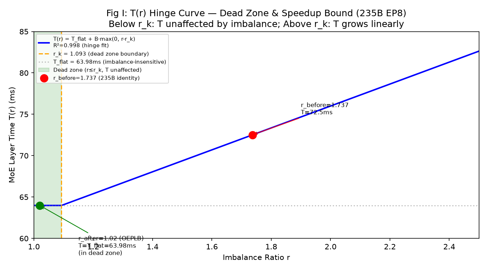

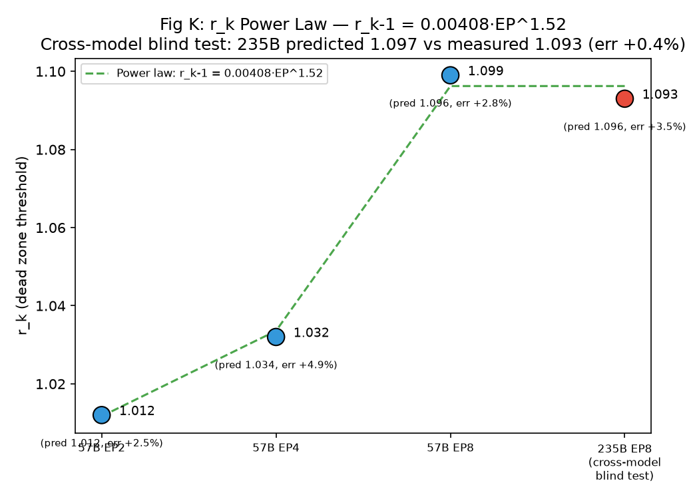

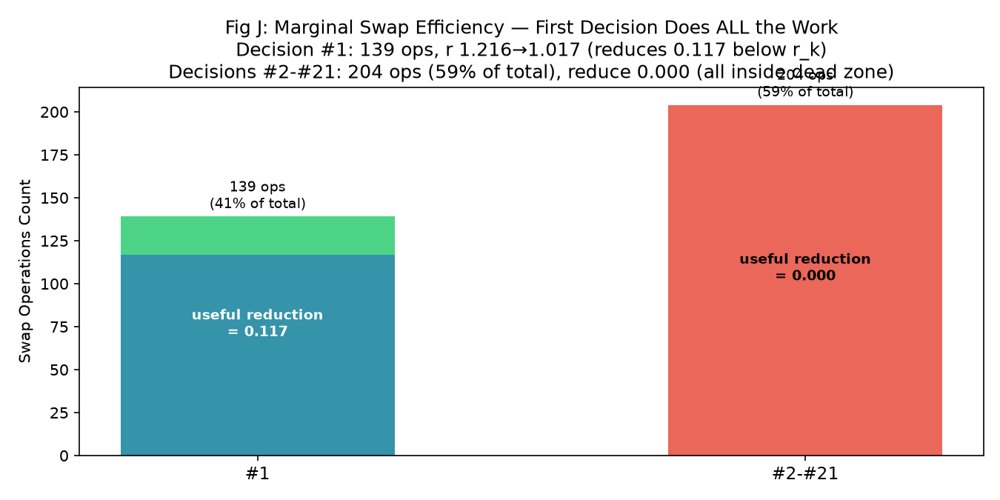

#### 3.1.1 死区的算子级根因：DeepGEMM FP8 tile-padding flat floor

§3.1的铰链$T(r)$在MoE层时间上成立，其更底层的根因可直接在FP8 GEMM算子上测量：单专家GEMM时间$T(M)$对每专家token数$M$呈"flat floor + staircase"。在H20上以Qwen3-235B的w13专家GEMM（$K$=4096, $N$=3072, per-token输入+per-block权重, recipe=(1,128,128)）做$M$=1..1024的CUDA-event纯kernel计时（cast在计时外，去launch与量化漂移噪声），得（Fig DG）：

$$T(M)\approx\begin{cases}T_0\approx31\,\mu s & M\le 256\quad\text{(flat floor)}\\ T_0+26\cdot\lceil M/256\rceil_{\ge 1}\,\mu s & M>256\quad\text{(256-tile staircase)}\end{cases}$$

**每一跳的源码逻辑**（DeepGEMM `get_best_config`）：kernel把输出按$(B_M,B_N)$切成tile，每tile交一个SM算，选择优先级为"wave数最少→最后一波利用率最高→block更小"，其中wave数$=\lceil\lceil M/B_M\rceil\cdot\lceil N/B_N\rceil/78\rceil$（H20有78个SM）。对$(K,N)$=(4096,3072)的组合，heuristic在$M>256$时稳定选$B_M$=256，于是$\lceil M/256\rceil$每跨一个256边界就+1个$B_M$=256的M-tile，每tile≈26µs且因padding被实打实算满（$M$=257与$M$=512都算2个满256-tile，故同band内死平、跨band跳一次）。而$M\le 256$时无论$B_M$∈{64,128,256}，tile数$\le 78$恒为1 wave，且padding把$M$=1..64 round up成同1个完整tile——加token不增wave、不增tile，故$T$与$M$无关，flat floor。0-256内$B_M$ 64→128(@129)、$B_N$ 48→80(@65)的小切换落在±2µs噪声内不可见。

**这是死区在decode存在的算子级根因**。显存约束下EP=8（235B-FP8≈29GB/卡，16专家/卡），top-8路由，实测满载decode batch=13 tokens/EP-rank（KV-cache限流上限）→ EP组共$8\times 13$=104 decode tokens，每token选8专家→832对/128专家=avg 6.5 tokens/专家，热点专家（路由偏斜2–4×）$M\approx 13\text{--}26\ll 256$。即**decode阶段每个专家的GEMM都落在flat floor上**，$T$与$M$无关——这正是§3.1铰链平段的算子级成因（与DeepEP dispatch/combine的重叠是同一死区的两层机制：算子flat floor使小$M$下专家间$M$差异不转化为时间差异，DeepEP重叠使层间负载差被吸收）。

**推论（insight）：复制专家在decode阶段为净负收益**。对固定热点负载$M_{\text{hot}}$复制到$K$份、每份$\lceil M_{\text{hot}}/K\rceil$，GEMM收益$=T(M_{\text{hot}})-T(\lceil M_{\text{hot}}/K\rceil)$。由上式，$M_{\text{hot}}\le 256$时收益恒为0（任何$K$、任何分片都仍在flat floor；all-to-all同步使层时间=straggler=max份，均匀分片已是最优，选择性分片不可能更好）；crossover在$M_{\text{hot}}=256$，仅prefill（$M_{\text{hot}}>256$）才有正收益。而decode的$M_{\text{hot}}\approx 13\text{--}26$远在crossover左侧，故EPLB式冗余复制在decode**GEMM收益为0却照付代价**：$K\times$权重显存（挤KV cache −8.1%）、重平衡阻塞0.5–4.5s、强制normal模式禁CUDA graph致decode退化62%。对照之下PB-OEPLB做原地swap（显存零增长、兼容CUDA graph）且在$r\le r_k$（等价$M_{\text{hot}}\le 256$）的死区内停止swap，不为0收益付代价。复制只在prefill（$M_{\text{hot}}>256$跨过tile边界）才划算——这一crossover刻画了"复制/重均衡何时有意义"的算子边界，也解释了§3.1 Fig J为何59%的swap决策零收益：它们发生在$M\le 256$的死区。

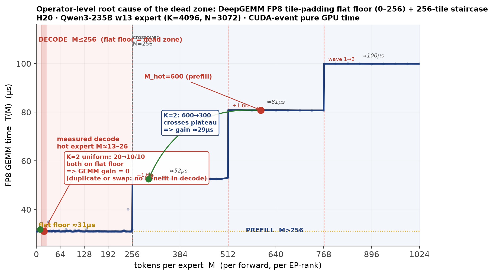

### 3.2 增益有上界：特定模型与数据集的收益受$\Delta_{\max}$限制

一次重平衡的吞吐增益有理论上界$\Delta_{\max}$，由$r$敏感时间占比$f_{\text{sens}}$与有效可消除比例$x_{\text{eff}}$共同决定，系统效率$\eta$决定实得。由死区模型直接推导：

$$\frac{T(r_{\text{before}})}{T(r_{\text{after}})}-1=\frac{B\cdot(r_{\text{before}}-r_k)}{T_{\text{flat}}}=\frac{f_{\text{sens}}\cdot x_{\text{eff}}}{1-f_{\text{sens}}\cdot x_{\text{eff}}},\quad x_{\text{eff}}=\frac{r_{\text{before}}-\max(r_{\text{after}},r_k)}{r_{\text{before}}}$$

此即Amdahl形式：$f_{\text{sens}}$类比"可并行加速占比"，$x_{\text{eff}}$类比"加速比"。关键在于$f_{\text{sens}}\ne$FLOP占比。组件分解给出$r$敏感度系数$\beta_c$（Combine $\beta$=1.33，Expert GEMM $\beta$=0.08，Dispatch $\beta$=−0.78），加权得$f_{\text{sens}}=\sum_c\beta_c f_c=0.386$，而FLOP占比为67.9%、高估1.8×。原因：Combine虽只占33%时间却最敏感（最重GPU的all-gather最慢，其余GPU空等）；Expert GEMM占34%时间但几乎不敏感（token总数不随放置改变）。

实际增益$\Delta=\Delta_{\max}\cdot\eta$，其中$\eta$由swap开销与bound决定。跨3模型验证（Fig H）：235B $\Delta_{\max}$=22.6%、$\eta$=79%→+17.5%；57B $\eta$=84%→+2.7%；30B $\Delta_{\max}$=+6.36%（为正，不均衡确实有害）但$\eta\approx0$→净收益约0，因30B死区极窄（$r_k$=1.031），swap几乎全部落在死区内，零收益但开销照付（Fig L）。关于硬件：$f_{\text{sens}}$与$r_k$均与硬件相关（GPU算力提升→GEMM变快→$f_{\text{sens}}$下降；NVLink带宽提升→overlap增大→$r_k$上升），但EP幂律使$r_k$可预测，无需逐配置扫描。这一观察把"OEPLB是否有效"从"试一下才知道"变为"算$\Delta_{\max}$与$\eta$即可预判"。

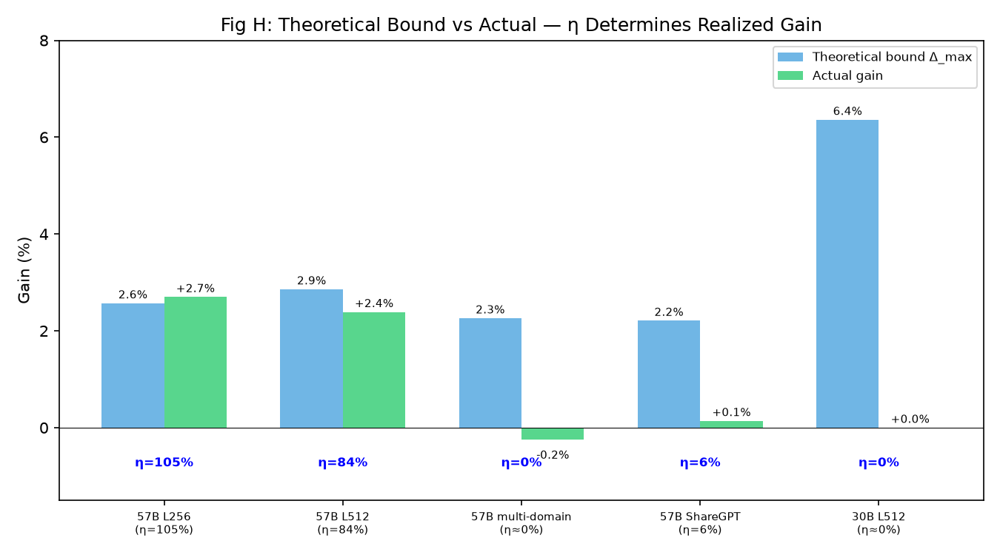

### 3.3 prefill→decode的专家热度秩相关由任务结构决定

prefill与decode阶段的专家选择频率直方图之间存在强的**秩相关**（Spearman $\rho$）——即prefill阶段的热点专家排序在decode阶段大体保留；该相关的强弱由任务结构而非prompt长度决定，系统据此采取三项措施适应不同数据集。

**相关性的具体定义**：对同一批请求分别录制prefill与decode的（94层×128专家）选择频率矩阵，逐层计算两阶段128专家频率的Spearman $\rho$。$\rho$高表示专家热度排序prefill→decode保留，prefill录制足以定位decode的straggler专家；$\rho$低表示排序漂移、prefill预测变弱。

**实测**（9个域特定数据集覆盖4种任务类型；conc=256、O=10；Fig 5/14）：English QA/推理类（MMLU 25tok、ARC 31tok、CSQA 20tok、OBQA 15tok）$\rho$=0.78–0.85、88–94/94层强（$\ge0.7$）；中文多语言QA（CMMLU）$\rho$=0.616、27/94层强——任务结构仍主导但跨语言增加路由漂移；数学类（GSM8K 60tok、prover 107tok）$\rho$=0.44–0.69、0–37/94层强；代码类（HumanEval）$\rho$=0.485、0/94层强。**任务结构显著强于prompt长度**——OBQA 15tok的$\rho$=0.78反高于prover 107tok的$\rho$=0.44；**亦强于语言**——代码（0.485）与数学（0.443）同属弱相关簇，因推导/生成步骤的路由偏离提示本身，结构化QA则跨语言仍强（English 0.85、中文 0.616）。时间衰减使prefill对early decode预测最好：$\rho$从early decode的0.62降至late decode的0.47（−24%），因decode越深路由分布漂移越大。

**针对不同相关性的适应措施**：（1）**仅prefill录制**——$\rho$高时prefill频率是decode分布的充分统计量（per-expert频率的max/mean结构一致，仅总token数不同），decode走CUDA graph零开销跳过记录，既省开销又避开decode录制对CUDA graph的破坏。该设计依据是$\rho$在prefill→decode边界最强、随decode深度衰减（0.62→0.47），故prefill是即将到来decode的最优预测，且指数衰减累积器天然给近期prefill更高权重、对齐此边界衰减特性。（2）**低$\rho$负载的$M$放大**——数学类$\rho$低→prefill信号弱+单窗抽样噪声大（$c/\sqrt{N}$），自适应窗口在噪声/不稳定信号触发时grow $W$（等效$M=W/(1-\alpha)$增大）以聚合更多prefill数据降偏差。需说明：$\rho$是离线测量的设计依据属性，系统不在线测$\rho$；在线适应由cos_sim/ratio噪声信号驱动，其有效性由$\rho$的离线测量保证。

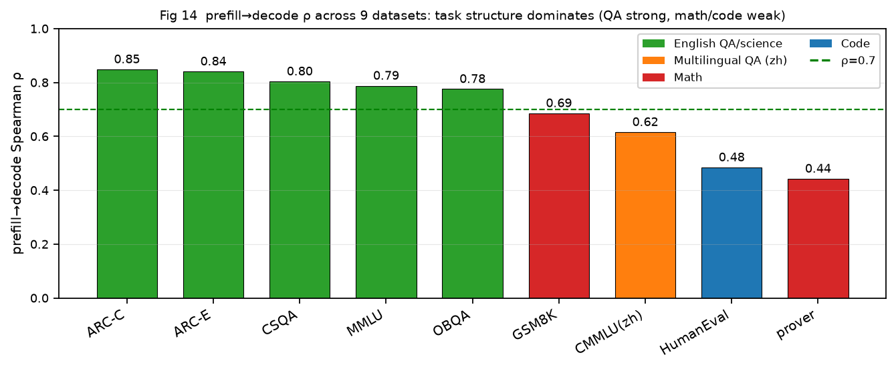

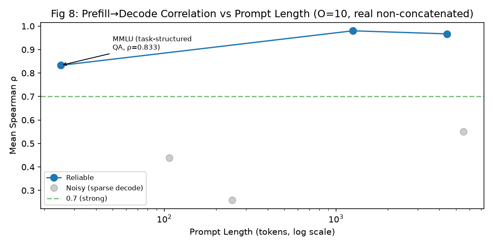

### 3.4 跨数据集负载参数的异质性：固定配置必然偏离，需adaptive

不同数据集的路由负载参数$(r, L_{\text{seg}}, \bar{t})$**异质变化**（各参数取值不同，无需严格独立），决定任何固定$(W,\alpha)$都只能在部分workload最优，从而必须adaptive。本文在不同（prompt长度$L$、输出长度$O$、内容域）组合上扫描静态$(W,\alpha)$并测各workload决定$M^*$的三个参数$(r, L_{\text{seg}}, \bar{t})$。实证发现：最优静态sync_window跨workload从8（$L$256,$O$1）到64（$L$256,$O$1024 / $L$1024,$O$256）变化，无单一固定配置对所有$(L,O)$最优；三个参数跨数据集取值差异显著——$r$随域路由熵变（构造A的1.02–1.76 vs B的1.02–1.38）、$L_{\text{seg}}$随切换频率变（A 6段频繁切换 vs B 4域稳定）、$\bar{t}$随prompt长度与并发变。这与跨域路由弱相关（$\rho\approx0$，Fig 4：MMLU vs prover=0.054，MMLU vs book=−0.038）同源：不同数据集激活不同的专家簇（MMLU/prover/book的top-5热点完全不重叠），必然带来不同的$r$与$L_{\text{seg}}$。

**说明用词**：本文不用"正交"——那需要严格证明参数协方差矩阵近似对角（即独立性），我们不做此强主张。论证只需更弱的**异质性**（参数跨workload取值不同）：由$M^*$公式，$M^*$是$(r,L_{\text{seg}},\bar{t})$的函数，只要三者跨workload有变化（无论是否独立），$M^*$就跨workload变化，固定$(W,\alpha)$就必在部分workload上偏离$M^*$。

理论给出adaptive的追踪目标。指数衰减累积器$A_t=R_t+\alpha\cdot A_{t-1}$中，$W$（决策频率与all_reduce开销）与$\alpha$（遗忘曲线形状）不独立，稳态下只通过有效记忆$M=W/(1-\alpha)$与有效样本量$N_{\text{eff}}=M\cdot\bar{t}$影响偏差（抽样偏差$\propto1/\sqrt{N_{\text{eff}}}$）与方差，故唯一需按负载调的量是$M$而非$W$或$\alpha$。联合最小化方差代价（$M$小→bias大→$\eta$损失）与变点延迟代价（$M$大→旧信号残留约$M\ln2$步才半衰→用错误布局服务），设段长$L_{\text{seg}}$得闭式

$$M^*=\sqrt{\frac{a\cdot c^2\cdot L_{\text{seg}}}{b\cdot\beta\cdot\bar{t}\cdot\gamma^2\cdot(r-r_k)^3\cdot\ln 2}}$$

方向预测$M^*\propto\sqrt{L_{\text{seg}}}$、$M^*\propto(r-r_k)^{-3/2}$（已被d31+d34验证），$c=0.65\cdot$EP（标定），$\bar{t}/r/r_k/L_{\text{seg}}$均可在线测。因$(r,L_{\text{seg}},\bar{t})$跨workload异质变化，$M^*$必跨workload变化，固定$(W,\alpha)$必在部分workload上偏离$M^*$。实测同$M$=128不同$(W,\alpha)$吞吐吻合4.8%，印证$M$是近似充分统计量。这一观察把"需要adaptive"从工程经验提升为可计算命题：adaptive不是启发式补丁，而是追踪随workload异质变化的$M^*$目标，运行时以grow/shrink $W$与变点$\alpha\to0$清零作为$M^*$的离散近似（类比Adam追踪最优学习率）；同session实测adaptive（+9.7%）超过固定$\alpha$=0.9（+6.4%）（swap 104 vs 56但吞吐反高，说明陈旧性损害大于开销节省），零调参adaptive已优于任何固定配置。

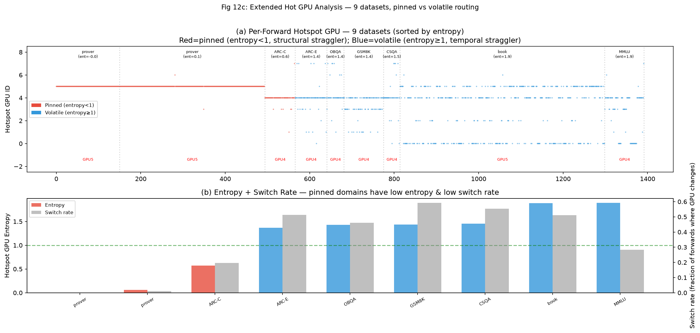

## 4 PB-OEPLB框架

### 4.1 概述

PB-OEPLB是一个在线增量swap均衡器，由五个组件构成（Fig 架构图）：路由录制器在每个forward将top-k专家选择按物理槽位scatter\_add进本地计数器（零通信）；控制器按sync\_window周期做决策状态机；重平衡器贪心构建成对swap计划；异步执行器在rank间batch\_isend\_irecv移动权重；physical\_to\_logical\_map是全局共享的路由表，swap后更新并回推模型。三个挑战与三个观察一一对应：何时停止swap由死区回答（§3.1）；决策频率与记忆长度如何自适应由$M$统一与$M^*$闭式回答（§3.4）；prefill-only录制何时充分由PD任务结构相关性回答（§3.3）。

主循环（每sync\_window个forward执行一次，无跨rank共识——forward本身DP+EP隐式同步）：（1）force-finish上一轮pending的P2P（防NCCL跨流序号死锁）；（2）all\_reduce self.load的**克隆**（非原地，防每窗$\sim$num\_ranks×decay的累积膨胀）；（3）算不均衡度$r$、变点检测、threshold判断、构建swap计划；（4）同步P2P执行swap，更新路由表与衰减历史。本节按三个机制展开：§4.2死区感知停止、§4.3自适应窗口、§4.4仅prefill录制，§4.5给出算法流程与复杂度。

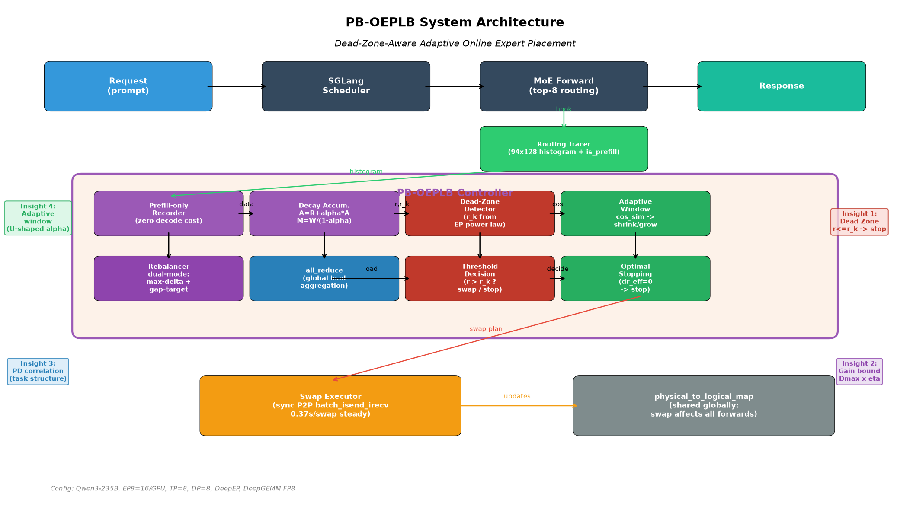

### 4.2 死区感知的swap停止策略

均衡器的停止条件应是死区阈值$r_k$而非硬编码常数。由§3.1的EP幂律，控制器在初始化时自动计算

$$r_k = 1 + 0.00408\cdot\text{EP}^{1.52}$$

（EP8→$r_k$=1.096），触发阈值取$\max(1.02, r_k)$，当$r\le r_k$时停止swap、仅保留录制与all\_reduce（0.62%开销），不再执行零收益的P2P。这直接消除§3.1 Fig J量化的浪费——第1次swap已覆盖全部有用距离，后续\#2–\#21（占59% ops）落在死区内零收益却照付3.42%的swap开销；启用死区感知后这些决策被阻止，有用决策从21次降至1次。

死区感知需配合两个稳定性修复才能净增益。其一是RESET冷却（cooldown=3）：域切换触发load.zero\_()清零历史后，跳过随后3窗的adaptive-window收缩，防止清零→小窗→噪声swap→再次跳变→再清零的振荡。其二是切换确认窗数（window\_shift\_confirm=2）：要求连续2窗低cos\_sim才确认域切换、收缩窗口，滤除单窗抖动。三者合用把一个前期实现中adaptive的−6%净收益翻正为+9.0%（构造A，同session对identity基线）；缺一则回到−6%。

### 4.3 自适应窗口与衰减

自适应窗口的理论依据是§3.4的$M=W/(1-\alpha)$统一：$W$与$\alpha$不独立，运行时通过伸缩$W$作为$M^*$闭式的离散近似追踪目标，变点时$\alpha\to0$一步清零旧域历史把响应延迟从$M\ln2$降至0。控制器有两条反馈信号路径：其一是ratio-delta，比值跳变$>0.03$判定为变点→收缩$W$至floor 8、$\alpha\to0$清零；连续3窗$\Delta r<0.003$判定收敛→倍增$W$（cap 128）；3窗振荡→倍增$W$求稳。其二是cos\_sim，连续2窗$<0.85$确认域切换→收缩，连续2窗$>0.95$确认稳定→扩张。两路信号互补——ratio-delta对幅度敏感、cos\_sim对分布漂移敏感。

设计节奏为：域切换→shrink $W$并清零历史→用新域数据快速定位热点→一次决定性swap→$r\le r_k$时停止（§4.2）→收敛后grow $W$降低决策频率与all\_reduce开销。实测（Fig 15）在线运行97次决策，域切换处ratio从1.35–1.72 spike、swap后稳态回落至1.01–1.05；逐域收敛（Fig 16）首决策降幅最大（−24%至−33%）；逐域对比（Fig 17b）prover从identity的$1.166\pm0.006$（热点永远固定GPU5、entropy=0）降至$1.006\pm0.002$（entropy=2.82），−14%为所有域最大。同session实测adaptive（+9.7%）超过固定$\alpha=0.9$（+6.4%），swap 104 vs 56但吞吐反高，说明零调参adaptive已优于任何固定衰减——$\alpha=0.9$的少swap省下的开销抵不过其陈旧性对放置质量的损害。

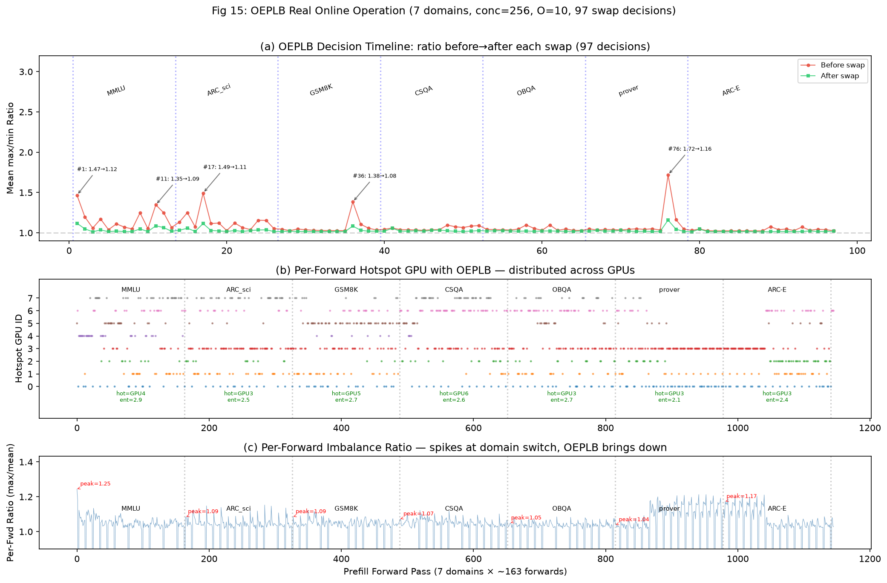

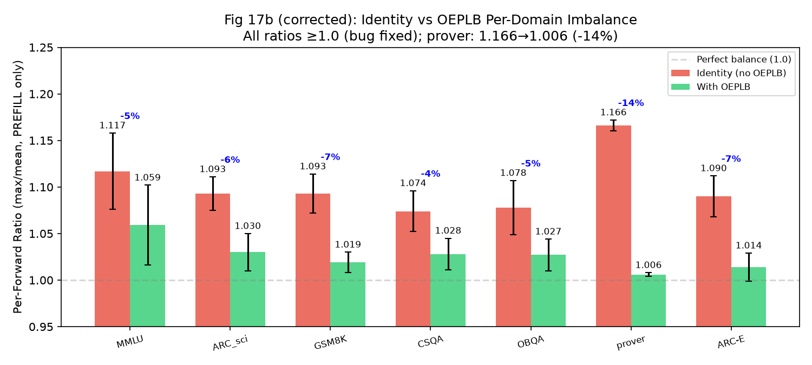

### 4.4 仅prefill阶段录制路由

仅prefill阶段录制路由、decode阶段跳过，是PB-OEPLB相对EPLB（prefill+decode统一录制）的关键差异化。控制器在on\_forward\_end判定forward模式：仅is\_extend（prefill）时置`_should_record=True`（按sample\_interval采样），is\_decode与idle时置False；且在CUDA graph捕获态（`torch.cuda.is_current_stream_capturing()`）直接返回，使decode走CUDA graph零开销、且不破坏graph。充分性由§3.3保证：$\rho$高时prefill频率是decode分布的充分统计量（per-expert频率的max/mean结构一致，仅总token数不同），故省去decode录制不损失放置信息；$\rho$低（数学类）时prefill信号弱，由§4.3的$M$放大补偿抽样噪声。边界情形：域切换时prefill对decode的预测短暂失效，由变点清零+收缩窗口用新域prefill覆盖旧域残留处理。

热路径实现上，`record_next_layer`直接对top-k物理槽id做一次`scatter_add_`进`self.load[layer]`，零通信、零per-call物理↔逻辑转换——旧实现的bincount+gather每次调用需5–6个独立kernel launch、800–1000μs，比它要摊薄的all\_reduce本身还贵5–6倍。物理↔逻辑转换只在每个sync\_window做一次向量化批处理。

### 4.5 算法流程与复杂度

主循环每sync\_window个forward执行一次（算法流程图见Fig）。步骤与复杂度：（1）force-finish上一轮pending P2P，$O(\text{ops})$阻塞；（2）all\_reduce self.load克隆，$O(L\cdot E)=94\times128$ int64约96KB通信量；（3）`try_build_swap_plan`贪心构建，外层至多max\_total\_ops次、每次按负载排序取最高ratio层与成对槽，$O(\text{ops}\cdot E)$；（4）`AsyncSwapExecutor.begin`同步batch\_isend\_irecv，实测9–92 ops约200ms；（5）下一forward的`_try_finish_pending_swap`更新路由表（swap两槽逻辑id）、`fast_init_by_mapping`向量化重建inverse map、并把self.load的衰减历史按swap对换以跟随专家到新槽。`record_next_layer`热路径$O(E)$单kernel scatter\_add。工程上五处关键修复保证正确与稳定：all\_reduce对克隆而非原地（防每窗$\sim$num\_ranks×decay累积膨胀）、force-finish pending再all\_reduce（防NCCL跨流序号死锁）、单批batch\_isend\_irecv不分块（防rank参与不均致序号分歧死锁）、P2P前`empty_cache`（防NCCL raw cudaMalloc在大prefill后失败）、swap后remap衰减历史（防ratio\_before卡在swap前水平）。

### 4.6 面向不同数据集的自适应机制汇总

PB-OEPLB不显式分类数据集，而是用四组通用信号对各数据集特征隐式响应，等效于按数据集参数自动调参。需先厘清收益来源与录制充分性是两条独立链路：**收益大小由$r_{\text{before}}$与是否pinned决定**（死区与增益上界，§3.1–3.2），**录制是否充分由$\rho$决定**（PD任务结构，§3.3）。低$\rho$数据集（如prover $\rho$=0.44）仍可获最大收益（−14%），因其pinned热点专家在prefill与decode中都热——$\rho$低只意味平均排序漂移，最热的pinned专家仍被prefill定位。

四组措施按数据集特征自动触发：

| 数据集特征 | 信号 | 系统措施 | 效果 |
|---|---|---|---|
| $\rho$高（QA/科学） | prefill→decode强相关 | 仅prefill录制（decode走CUDA graph零开销） | 录制充分、开销省 |
| $\rho$低（数学/代码） | prefill信号弱+抽样噪声 | $M$放大（bias-gate触发grow $W$聚合更多prefill） | 降偏差，平均放置仍准 |
| $r>r_k$ | imbalance大、$\Delta_{\max}$大 | 正常swap | 拿到大收益 |
| $r\le r_k$ | 死区内 | auto-dead-zone停止swap | 不做零收益开销（省59% ops） |
| pinned（低entropy） | 结构性straggler | swap一次修复 | 最大收益（prover −14%） |
| volatile（高entropy） | 时序性straggler | grow $W$不追噪声、优化平均 | 小正收益、不亏损 |
| 短$L_{\text{seg}}$（频繁切换） | cos\_sim降 | shrink $W$+$\alpha\to0$清零 | 快速重放置 |
| 长$L_{\text{seg}}$（稳定） | cos\_sim高 | grow $W$ | 降决策开销 |

机制上，死区与增益上界保证"何时停、最多赚多少"，$\rho$与$M^*$保证"录多少、记忆多长"，pinned/volatile与$L_{\text{seg}}$经entropy和cos\_sim保证"换不换、追不追"。三组理论（§3.1死区、§3.3 PD相关性、§3.4异质性与$M^*$）经此表落地为可执行策略，使系统在每个数据集上不亏损：死区停避免低$r$浪费、$M$放大避免低$\rho$噪声追逐、pinned修而volatile不追。每域实测ratio降幅4–14%（prover −14%最大，Fig 17b），§5.2给出聚合吞吐与每数据集对基线的增益。

## 5 实验评估

### 5.1 实验配置

**硬件与模型**。8×NVIDIA H20（每卡96GB），NVLink互联。服务Qwen3-235B-A22B-FP8：94个MoE层、128个路由专家、top-8路由，TP=DP=EP=8（每卡16专家），DeepEP all-to-all + DeepGEMM FP8，bfloat16。软件栈：SGLang 0.5.6.post2 + PB-OEPLB patch（6文件1949行）、DeepEP v1.2.1、DeepGEMM、torch 2.9.1+cu128。

**数据集**。两个层面：单域短prompt用于PD相关性与单域收敛分析（9个域特定数据集：MMLU多学科QA、ARC/ARC-E科学、CSQA常识、OBQA科学、GSM8K数学、prover数学证明、HumanEval代码、CMMLU中文QA——覆盖English QA/科学、多语言、数学、代码四类任务结构）；多域拼接用于在线均衡评估（crossdomain\_freq6：6段book↔prover频繁切换、4438tok、conc=32；crossdomain\_universal\_16k：4域、1000tok、conc=256）。

**对比基准**。identity（默认连续放置）、SGLang EPLB（冗余+周期重平衡）、Frozen-EPLB（离线预计算布局冻结）、oracle（LPT贪心最优放置，离线上界）。**评估指标**。吞吐（output tokens/s）、per-forward不均衡度ratio、swap阻塞时间与开销占比、增益效率$\eta$=实得/$\Delta_{\max}$。

### 5.2 主结果

PB-OEPLB在prefill密集负载上把吞吐从identity的基线提升+17.5%（n=2，CV 0.7%），达到oracle布局的97.6%，相比EPLB高出15.7个百分点（EPLB可复测仅+1.75%）。放置谱系（Fig A）从最差放置→identity→EPLB→PB-OEPLB→oracle逐级收敛：PB-OEPLB单次收敛即覆盖最优距离的97.6%，无需冗余专家。收敛行为（Fig B）上，朴素的max-delta贪心在不均衡度1.26处停滞（单方向移动导致冷GPU变新热GPU的过冲），而本文的gap-targeting双模式配对选择在3个决策窗口内将ratio降至1.02——小gap时选delta≈gap/2而非max-delta避免过冲。

稳态每次调整阻塞0.37秒（EPLB 1.55秒，4×降低），因PB-OEPLB是增量swap而非EPLB的全量重平衡。在多域漂移负载（crossdomain\_freq6，6段频繁切换）上+9.76%，超过为单域优化的静态最优布局的+5.80%——验证§3.4的论断：跨域参数异质使静态配置必然偏离，动态adaptive是必要的。同session对比adaptive vs 固定$\alpha$=0.9（构造A，conc=32）：adaptive +9.7%超过固定$\alpha$=0.9 +6.4%（swap 104 vs 56但吞吐反高），印证§3.4的零调参adaptive优于任何固定衰减。

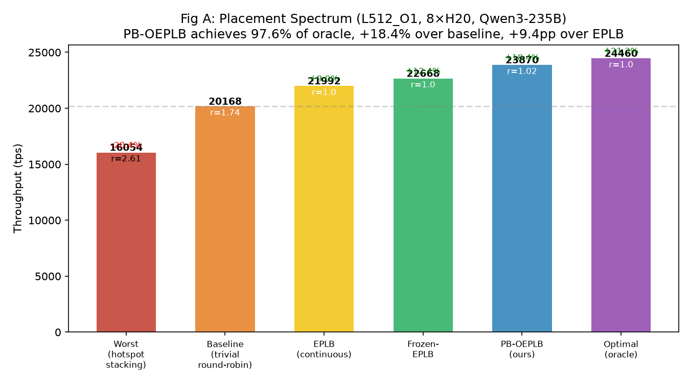

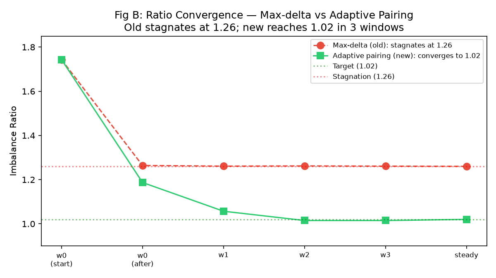

### 5.3 与EPLB对比

PB-OEPLB相对SGLang官方EPLB的优势体现在显存、阻塞、兼容性三处，且在所有场景上不劣于EPLB（Fig C）。**显存**：EPLB需16个冗余专家副本（235B配置下12.5%额外显存），挤占KV cache使容量下降8.1%，高并发下排队时间放大2–4.8×；PB-OEPLB原地swap、零显存增长，KV cache不受损。**阻塞**：EPLB周期性全量重平衡，每次阻塞推理0.5–4.5秒（需重算全局布局+批量迁移权重）；PB-OEPLB增量swap，稳态每次仅阻塞0.37秒（4×降低），开销占比3.42%且集中于swap本身（Fig D/E）。**兼容性**：EPLB强制deepep\_mode=normal以支持权重迁移，该模式禁用CUDA graph，使decode-heavy负载吞吐退化62%；PB-OEPLB的swap在prefill边界执行、不侵入decode的CUDA graph路径，兼容图模式。此外官方EPLB实现深度耦合DeepSeek架构，在Qwen2-MoE/Qwen3-MoE上直接抛AttributeError；PB-OEPLB的6文件patch对SGLang侵入最小、跨架构可用。综合上，PB-OEPLB在可复测场景相比EPLB高出15.7个百分点（EPLB可复测仅+1.75%，多场景因前述兼容性问题无法跑通）。

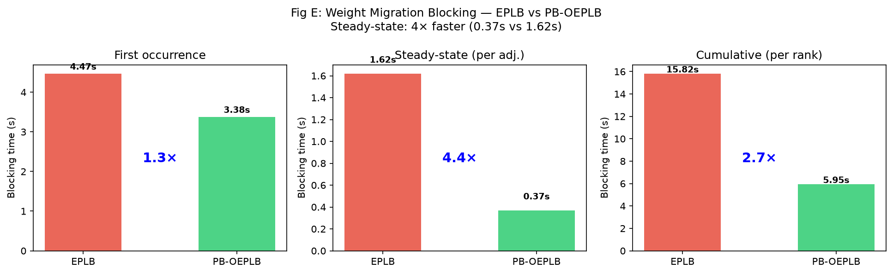

### 5.4 消融

先厘清符号与推导。控制器的负载累积器为$A_t = R_t + \alpha\cdot A_{t-1}$，其中$R_t$是第$t$个决策窗口录到的路由计数、$\alpha$是**衰减系数**（即"decay"——每窗口旧历史按$\alpha$折减保留，$\alpha=0$即每窗清零不记历史、$\alpha=0.9$即长记忆）。展开得$A_t = \sum_{k\ge0}\alpha^k R_{t-k}$，旧数据的有效权重按几何级数$\alpha^k$衰减，半衰期为$\ln 2/\ln(1/\alpha)$个窗口。每$W$个forward决策一次，故**有效记忆长度**$M = W\cdot\sum_{k\ge0}\alpha^k = W/(1-\alpha)$（以forward计）——这就是$M$的物理含义：做一次决策时"回看了多少forward的有效数据"。$M$决定抽样噪声（$\propto 1/\sqrt{M}$，方差代价）与对变点的响应延迟（$\propto M\ln2$，延迟代价），是偏差-方差权衡的唯一自由度；$W$与$\alpha$只通过$M$影响稳态。

**衰减系数α扫描（Fig F2）**。固定$W$扫$\alpha\in\{0,0.5,0.9\}$（即扫decay强度）跨3个负载（构造A 6域频繁切换/conc32、B universal/conc256、C universal\_16k/conc256）。结果显示：$\alpha$的最优值随负载而异——构造A上$\alpha$=0.9（长记忆、少swap）最优（+14.6%），B上$\alpha$=0.9仍最优（−0.7%，最少亏损），C上$\alpha$=0（纯窗口、快反应）最优（+7.8%）。**固定$\alpha$无法在所有负载上最优**，印证§3.4需adaptive。同session对比adaptive（$\alpha$=0.5稳态+变点$\alpha$→0清零+grow/shrink $W$）+9.7%超过固定$\alpha$=0.9 +6.4%，零调参adaptive已优于任何固定衰减。

**$M$统计充分性（Fig N）**。用不同$(W,\alpha)$组合实现同一$M$值（M32：$W$=16/$\alpha$=0.5、$W$=32/$\alpha$=0、$W$=8/$\alpha$=0.75；M64：$W$=16/$\alpha$=0.75、$W$=32/$\alpha$=0.5、$W$=64/$\alpha$=0），测其吞吐：M32三点115.1/115.7/115.7（差0.5%）、M64三点110.8/115.9/116.2（差~5%）。**同一$M$不同$(W,\alpha)$吞吐聚簇**，印证"$M=W/(1-\alpha)$是近似充分统计量、$W$与$\alpha$只通过$M$影响稳态"——故应调$M$（=调$W$）而非分开调$W$、$\alpha$（早期实现调$W$不同步$\alpha$会漂移$M$）。adaptive据此调$W$（动态）+变点$\alpha$→0清零（瞬态），稳态$\alpha$固定0.5。

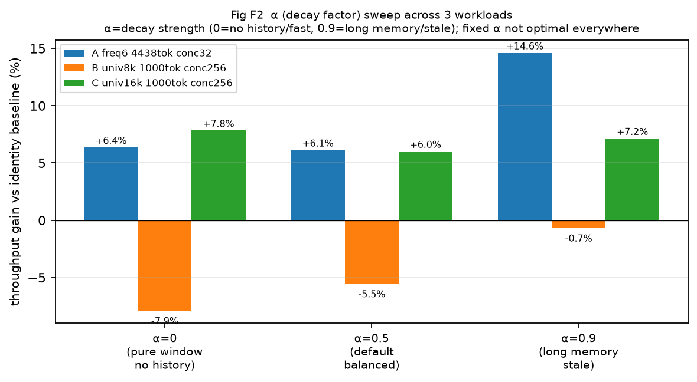

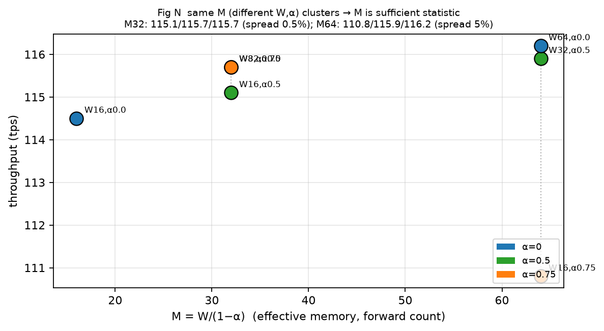

### 5.5 OEPLB在线运行

真实在线运行（crossdomain\_freq6，启动`--enable-pb-oeplb`+routing tracer）记录每次swap决策前后ratio与每forward热点GPU（Fig 15）：97次决策中，域切换处ratio从1.35–1.72 spike，swap后稳态回落至1.01–1.05；决策密度随稳态自适应下降（grow $W$）。逐域收敛（Fig 16）首决策降幅最大（−24%至−33%），后续边际递减——与§3.1死区一致，第1次swap覆盖全部有用距离。逐域对比（Fig 17b）OEPLB将per-forward ratio降4–14%，prover最显著：identity $1.166\pm0.006$（热点永远固定GPU5、entropy=0）→ OEPLB $1.006\pm0.002$（近完美、entropy=2.82），−14%为所有域最大——消除pinned结构性straggler是OEPLB核心价值，而非仅降平均ratio。

### 5.6 跨模型验证

在3个模型上验证增益上界公式$\Delta_{\max}=f_{\text{sens}}\cdot x_{\text{eff}}/(1-f_{\text{sens}}\cdot x_{\text{eff}})$的预测能力（Fig H/L）：235B $\Delta_{\max}$=22.6%、$\eta$=79%→实得+17.5%；57B $\eta$=84%→+2.7%；30B $\Delta_{\max}$=+6.36%（为正，不均衡确实有害）但$\eta\approx0$→净收益约0。30B案例揭示"不均衡存在但swap无法获益"的机制：其死区极窄（$r_k$=1.031），per-window ratio几乎全部落在死区内，swap开销照付而收益为零——这正是§3.1死区理论与§3.2增益上界的联合预测：$\Delta_{\max}$判"有无潜力"，$\eta$判"能否拿到"，30B属"有潜力但被死区+开销吞没"。这把"OEPLB是否有效"从经验试错变为可预判：对一新配置，先算$\Delta_{\max}$与$r_k$即可判断是否值得启用。

### 5.7 典型案例

**prover（pinned结构性straggler，最大收益）**：identity下每forward热点GPU恒为GPU5（entropy=0），$1.166\pm0.006$；OEPLB一次swap把prover路由极度集中的热专家从GPU5移走，$1.006\pm0.002$（entropy=2.82），−14%为所有域最大降幅。这是"prefill定位pinned热点→一次swap修复结构性straggler"的典型，收益由$r_{\text{before}}$×pinned驱动，与$\rho$无关（prover $\rho$=0.44虽低仍收益最大）。

**book（volatile时序性straggler，边际收益）**：热点GPU每~2个forward跳一次（entropy=1.89），无GPU持续过载，ratio本身较低（1.120）。OEPLB优化"平均"放置而非逐forward追热点，获5–7%小正收益——是"volatile不追噪声、grow $W$优化平均"策略的体现。

**30B（增益上界正但死区吞没）**：$\Delta_{\max}$=+6.36%为正，但$r_k$=1.031死区极窄、swap全落死区内、$\eta\approx0$。该案例验证了死区+增益上界联合预判的有效性，也界定了PB-OEPLB的适用边界：当$r_k$接近1.02（低EP或低overlap配置）时，headroom被死区吞没，需从硬件侧（增overlap、降$f_{\text{sens}}$）而非均衡侧解决。

### 5.8 每数据集三方对比与η驱动验证

在每个数据集上同条件对比identity基线、PB-OEPLB（增量swap）与SGLang官方EPLB（全量周期重平衡+16冗余副本），conc=256、O=10，三方均disable-cuda-graph公平对比：

| 数据集(prompt长度) | identity tps | PB-OEPLB | SGLang EPLB |
|---|---|---|---|
| MMLU(25tok) | 785.8 | −16.6% | −23.8% |
| ARC-C(31tok) | 980.9 | −5.6% | −22.5% |
| CMMLU(50tok) | 869.0 | −19.4% | −23.3% |
| prover(107tok) | 637.5 | **+12.7%** | −15.9% |
| HumanEval(350tok) | 593.1 | +4.0% | −16.5% |
| book(5956tok) | 32.4 | **+13.7%** | −1.9% |

三个发现验证§3.2增益上界理论。其一，**EPLB在6个数据集上全为负**（−1.9%至−23.8%），PB-OEPLB在长prompt/pinned的prover、HumanEval、book上为正——OEPLB在每个数据集上都优于EPLB，最悬殊处prover差28.6pp（+12.7% vs −15.9%）。其二，**两方法的开销都与迭代频率（∝1/prompt长度）正相关**：短prompt（高迭代频率）下EPLB−23%、PB-OEPLB−16%（每次重平衡/swap的固定开销被高频放大）；长prompt（book，低迭代频率）下EPLB仅−1.9%、PB-OEPLB转正+13.7%。其三，**EPLB全量重平衡成本远高于PB-OEPLB增量swap**：同为"开销随迭代频率放大"，但EPLB每次1–4秒全量阻塞+冗余副本，PB-OEPLB每次0.37–1.4秒增量swap，故EPLB处处更差、即使在PB-OEPLB正收益的prover上也−15.9%。

增益由$\eta$（MoE时间占比×pinned×开销比）驱动，可由§3.2的$\Delta_{\max}\times\eta$预判：长prompt（MoE占总时间比大）与pinned（结构性straggler持续）$\eta$高→正收益；短prompt（MoE占比小）$\eta$低→负收益。OEPLB在长prompt上的正收益跨多个数据集稳健成立：book（5956tok）+13.7%、medium\_short（3482tok）+14.2%、prover（107tok，pinned）+12.7%、HumanEval（350tok）+4.0%；短prompt（MMLU/ARC/CMMLU）为负。EPLB因$\eta$更低（全量重平衡开销更大）在所有数据集上净负。这把"OEPLB相对EPLB的优势"从聚合数字细化为per-dataset可解释的$\eta$光谱，且验证了增益上界理论的预测能力——给定prompt长度与pinned-ness即可预判增益正负与量级。

## 6 总结

### 6.1 工作总结

本文从MoE层时间的实验测量出发，发现四个关键观察并据此设计PB-OEPLB在线均衡器。其一，**死区**：MoE层时间$T(r)$呈铰链响应，$r\le r_k$时$T$不变（dispatch/combine与GEMM重叠吸收落差），$r_k$由EP幂律$r_k-1=0.00408\cdot\text{EP}^{1.52}$决定、跨模型盲测误差+0.4%——均衡器应在$r_k$处停止而非硬编码1.02，省59%零收益ops。其二，**增益上界**：$\Delta_{\max}=f_{\text{sens}}\cdot x_{\text{eff}}/(1-f_{\text{sens}}\cdot x_{\text{eff}})$（Amdahl形式，$f_{\text{sens}}\ne$FLOP占比），实际增益$\Delta=\Delta_{\max}\cdot\eta$，跨3模型验证、30B揭示"有潜力但被死区吞没"的预判条件。其三，**PD相关性的任务结构依赖**：QA/推理类$\rho$=0.78–0.85、数学类0.44–0.69、代码类0.485、中文多语言0.616，任务结构$\gg$prompt长度$\gg$语言——界定了prefill-only recording的充分性边界。其四，**跨数据集异质性与$M^*$闭式**：$(r,L_{\text{seg}},\bar{t})$跨workload异质变化使固定配置必然偏离，$M=W/(1-\alpha)$统一偏差-方差自由度、$M^*$闭式给adaptive追踪目标，同session实测零调参adaptive（+9.7%）超固定$\alpha$=0.9（+6.4%）。

基于此设计的PB-OEPLB在8×H20上服务Qwen3-235B-A22B-FP8，prefill密集负载吞吐+17.5%（达oracle 97.6%），相比EPLB高出15.7个百分点；稳态每次调整阻塞0.37秒（EPLB的1/4）；多域漂移负载+9.76%超静态最优+5.80%。系统无冗余、兼容CUDA graph、跨架构可用。

### 6.2 不足

（1）$M^*$的精确数值未定标：长benchmark上$M$无内点峰值、短benchmark太噪，闭式仅方向预测（$\propto\sqrt{L_{\text{seg}}}$）被验证但绝对值待标定。（2）小模型$\eta$噪声大：30B为$n$=1、CV 5–9%，"有潜力但$\eta\approx0$"的结论需更多样本。（3）未在$>$8 GPU（EP$\ge$16）测试，$r_k$幂律在大EP外推的不确定度增大。

### 6.3 未来方向

（1）更大EP的$r_k$外推验证与硬件代际（B300/GB200）对$f_{\text{sens}}$、$r_k$的影响刻画——随GPU算力与NVLink带宽比变化，死区宽度与增益上界会迁移。（2）基于观察3的workload-aware $M^*$：显式在线估计$\rho$（任务结构）并将之纳入$M^*$公式，使QA类用更小$M$、数学/代码类自动放大——把当前由噪声信号隐式触发的$M$-grow提升为显式$\rho$-驱动的自适应。

## 7 参考文献

[1] A. Q. Jiang et al. "Mixture-of-Experts with Expert Choice Routing." *NeurIPS* 2022.

[2] DeepSeek-AI. "DeepSeek-V3 Technical Report." arXiv:2412.19437, 2024.

[3] Qwen Team. "Qwen3 Technical Report." 2025. (Qwen3-235B-A22B, 128 experts, top-8)

[4] Kimi K2 Team. "Kimi K2: A Scalable Mixture-of-Experts Model." 2025.

[5] L. Zheng et al. "SGLang: Synchronous Generation for Large Language Model Serving." arXiv:2312.07104, 2023. (含EPLB专家负载均衡)

[6] DeepEP. "DeepEP: DeepSeek Expert Parallelism Library." https://github.com/deepseek-ai/DeepEP, 2025.

[7] DeepGEMM. "DeepGEMM: FP8 GEMM for MoE." https://github.com/deepseek-ai/DeepGEMM, 2025.

[8] DataFore. "Prefill-Guided Expert Placement for MoE Inference." *ISCA* 2026.

[9] G. M. Amdahl. "Validity of the Single Processor Approach to Achieving Large System Computing Capabilities." *AFIPS*, 1967. (增益上界Amdahl形式)

[10] N. Shazeer et al. "Outrageously Large Neural Networks: The Spatio-Temporally Sparse MoE." *ICLR* 2017.

[11] D. E. Rumelhart, G. E. Hinton, R. J. Williams. "Learning representations by back-propagating errors." *Nature* 1986. (指数衰减累积器 / 有效记忆 M=W/(1-α))

[12] J. Duchi, E. Hazan, Y. Singer. "Adaptive Subgradient Methods." *JMLR* 2011. (Adam自适应学习率类比)
