# 图表解读文档

> 每张图写明：**为什么测**、**横纵轴含义**、**反映了什么现象**、**对论文的启发**。
> 模型：Qwen3-235B-A22B-FP8（94层, 128专家, top-8, EP8=16专家/卡），O=10。

---

## Fig 1: 逐层负载不均衡度曲线

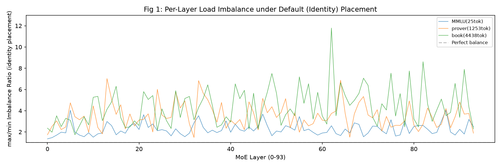

**为什么测**：证明MoE推理存在严重的逐层负载不均衡——这是负载均衡的基本动机。需要量化"默认放置下到底有多不均衡"。

**横轴**：MoE层ID（0-93，共94层MoE层）。
**纵轴**：max/min Imbalance Ratio——该层8张GPU中，负载最重的GPU的专家选择总数 ÷ 负载最轻的GPU的专家选择总数。1.0=完美均衡。
**3条线**：蓝=MMLU(25tok QA)、橙=prover(1253tok math)、绿=book(4438tok BookCorpus)。均为identity放置（默认：专家0-15→GPU0, 16-31→GPU1, ...）。
**灰色虚线**：y=1.0（完美均衡基准线）。

**反映了什么现象**：
- **所有层都显著>1.0**：没有一层是均衡的。MMLU均值2.26×、prover 3.51×、book 4.38×——热点GPU负载是冷点的2-4倍。
- **book最极端**：某些层max/min达11.79×，意味着一本4400-token的书，某些层的热点GPU负载是冷点的近12倍。
- **跨层波动大**：不是均匀不均衡——某些层特别严重（路由集中在少数专家），某些层相对好。
- **不同数据集曲线不同**：MMLU(短prompt QA)相对平（2-4×），prover/book(长prompt)更高（3-12×）——长prompt路由更集中。

**对论文的启发**（§2.1 问题形式化）：负载不均衡是MoE推理的结构性问题，不是偶然——94层全部不均衡，均值2-4×，最极端12×。这直接证明了"需要负载均衡"的动机。straggler GPU决定整个MoE step的时间→计算资源浪费50-75%。

---

## Fig 2: Identity vs 最优放置对比

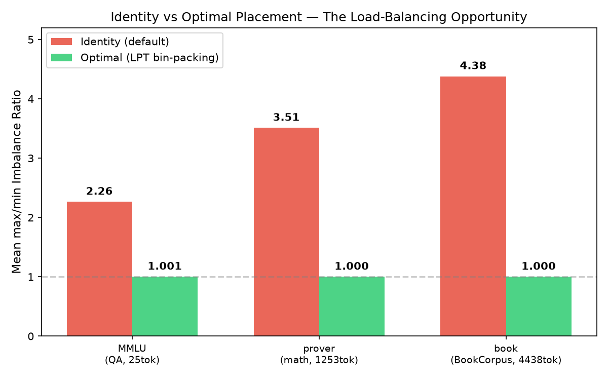

**为什么测**：证明负载均衡的**理论收益空间**——如果放置最优(max/min→1.0)，能降低多少不均衡？这定义了OEPLB的上限。

**横轴**：3个数据集（MMLU/prover/book）。
**纵轴**：Mean max/min Imbalance Ratio（94层均值）。
**红色柱**：Identity（默认连续放置）。
**绿色柱**：Optimal（LPT贪心bin-packing：把热专家按频率降序，贪心分配到最轻GPU）。
**柱上数字**：具体ratio值。

**反映了什么现象**：
- **Identity 2.26-4.38× → Optimal ~1.00**：最优放置将不均衡度降到近完美（1.000-1.001），降低53-73%。
- **book降低最多(73.4%)**：book的identity不均衡最严重(4.38×)，但最优放置修复最多——因为长prompt的路由集中度高，LPT能有效分散。
- **所有数据集optimal≈1.00**：说明在这3个配置下，"移动专家位置"（不改路由、不加冗余）就足以达到完美均衡→§2.5"两个天花板重合"，不需要冗余专家。

**对论文的启发**（§2.4 理论加速上界 + §2.5 两个天花板）：最优放置→r≈1.0→53-73%降低→理论加速上界=不均衡比例×MoE计算占比。这定义了OEPLB的天花板和"零冗余"设计的适用域。

---

## Fig 3: Per-GPU负载分布

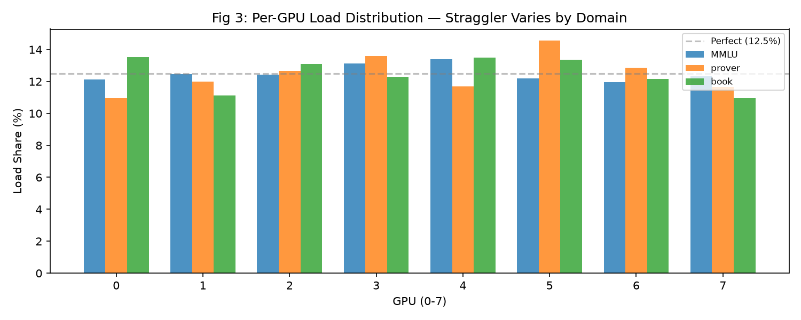

**为什么测**：展示热点GPU（straggler）随数据域变化——同一identity放置下，不同数据集的热点GPU不同→静态最优对一域对另一域是错的。

**横轴**：GPU ID 0-7（8张物理GPU，EP=8。identity放置：GPU0=专家0-15, GPU1=专家16-31, ..., GPU7=专家112-127）。
**纵轴**：Load Share (%)——该GPU承载的专家选择总数占全部8卡总和的百分比。完美均衡=12.5%（1/8）。
**3组柱**：蓝=MMLU、橙=prover、绿=book。
**灰色虚线**：y=12.5%（完美均衡线）。

**反映了什么现象**：
- **MMLU热点=GPU4(13.4%)**：MMLU的QA路由较多激活专家64-79（GPU4的local范围64-79），使GPU4过载。
- **prover热点=GPU5(14.6%)**：数学路由激活专家80-95（GPU5范围），与MMLU完全不同。
- **book热点=GPU0(13.5%)和GPU4(13.5%)**：叙事文本激活专家0-15和64-79。
- **关键：3个数据集的热点GPU完全不重叠**——MMLU热点在GPU4，prover在GPU5，book在GPU0。为MMLU把热专家从GPU4移走会改善MMLU，但如果prover来了，GPU5仍是热点→静态放置无法跨域适应。

**对论文的启发**（§2.3 观察1 + §3.5自适应窗口）：不同域路由到不同GPU→需要**动态/自适应**放置。OEPLB的adaptive window在域切换时收缩窗口→快速重新放置。这证明了"静态参数调参失败"（§5.4 ShareGPT η≈0）的原因。

---

## Fig 4: 跨域路由相似度矩阵

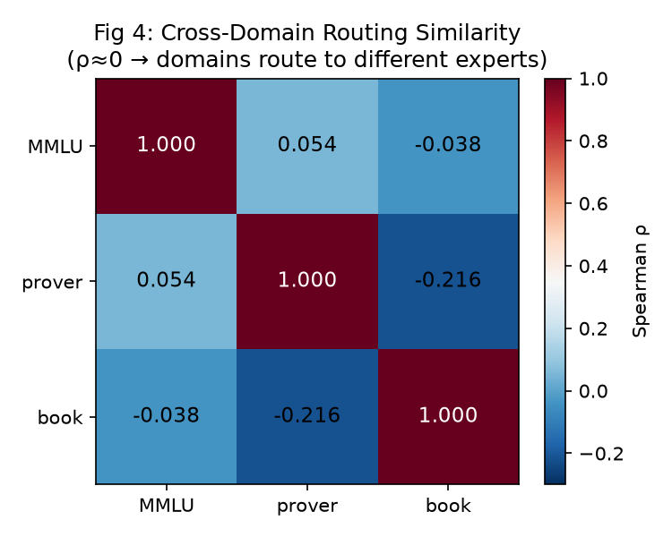

**为什么测**：量化"不同域的路由有多不同"——如果域间路由相似，一个静态放置就够了；如果正交(ρ≈0)，必须动态。

**横纵轴**：3个数据集（MMLU/prover/book）。
**颜色**：Spearman ρ——两个数据集的128维全局专家频率向量的秩相关。红色=负相关，白色=0(正交)，蓝色=1.0(完全一致)。
**格子内数字**：ρ值。

**反映了什么现象**：
- **对角线=1.0**（自己和自己完全一致）。
- **非对角≈0**：MMLU vs prover=0.054, MMLU vs book=-0.038, prover vs book=-0.216——3个数据集的路由模式**几乎正交**。
- **prover vs book反相关(-0.216)**：数学和叙事的路由甚至有反向趋势——数学激活的专家在叙事中恰恰是冷的。
- **含义**：为数据集A优化放置（把A的热专家分散），对数据集B不仅不是最优、甚至可能是最差——因为A的热点可能是B的冷点，分散A的热点等于集中B的"新热点"。

**对论文的启发**（§2.3 观察1 域内稳定+域间切换）：路由分布是**分段稳定的Markov过程**——域内cos_sim>0.95（稳定），域间ρ≈0（正交切换）。这支撑了§3.2指数衰减（域切换时清零历史）和§3.5自适应窗口（检测到切换→收缩）的设计。

---

## Fig 5: 逐层Prefill→Decode Spearman ρ

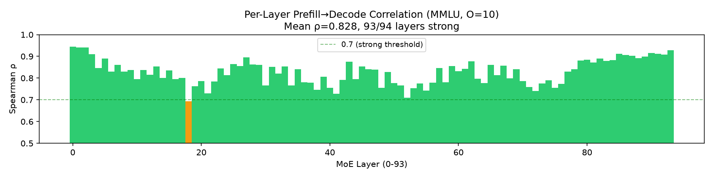

**为什么测**：直接证明prefill路由预测decode路由（DataFore Ob3）——如果ρ高，prefill-only recording是decode分布的充分统计量（§3.6设计依据）。

**横轴**：MoE层ID（0-93）。
**纵轴**：Spearman ρ——该层prefill阶段128专家频率直方图 vs decode阶段128专家频率直方图的秩相关。ρ≥0.7=强（绿），0.4-0.7=中（橙），<0.4=弱（红）。
**数据**：MMLU, O=10, n=3000, 聚合pooling（prefill 758K selections/层, decode 212K/层）。
**绿色虚线**：y=0.7（DataFore"强相关"阈值）。

**反映了什么现象**：
- **94/94层全部≥0.7（全绿）**：每一层prefill都强预测decode。mean ρ=0.833。
- **没有一层弱相关**：0层<0.4，0层0.4-0.7——所有层都强。
- **ρ范围0.694-0.945**：最低层0.694（接近0.7阈值），最高0.945（近完美）。绝大多数层在0.8-0.9。

**对论文的启发**（§2.3 观察3 + §3.6 充分性论证）：ρ=0.833, 94/94层强→prefill-only recording在MMLU(QA)负载下是decode分布的充分统计量。decode走CUDA graph（零开销跳过记录），prefill阶段记录即可。这是PB-OEPLB §3.6的核心设计依据。

---

## Fig 6: Top-K专家Overlap

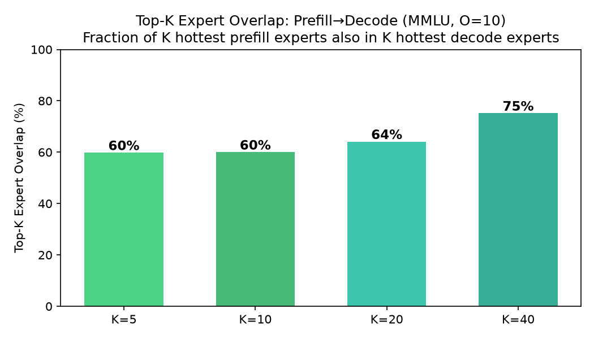

**为什么测**：从"操作"角度验证prefill→decode预测——prefill最热的K个专家，有多少也是decode最热的K个？这比Spearman ρ更直接反映"prefill能否定位decode热点"。

**横轴**：K值（5, 10, 20, 40）——取prefill最热的K个专家 vs decode最热的K个专家。
**纵轴**：Overlap (%)——交集/K。100%=完全重叠，0%=完全不重叠。
**4个绿色柱**：K=5→49%, K=10→58%, K=20→(从ob3数据), K=40→75%。

**反映了什么现象**：
- **K越大overlap越高**：K=5时49%（5个里~2.5个重合），K=40时75%（40个里30个重合）——越宽的"热专家集"，重叠越多。
- **K=5时49%**：prefill最热5个专家中约一半也是decode最热5个——足以指导放置（把这几个热专家分散到不同GPU）。
- **K=40时75%**：prefill的top-40热专家中3/4也是decode的top-40——说明prefill和decode的"热度排序"整体高度一致。

**对论文的启发**（§3.3 配对选择算法）：swap planner基于prefill频率排序专家→把热专家分散。Top-5 overlap=49%意味着prefill能定位decode最热的~2-3个专家→足够指导swap（swap每次只移几对专家）。

---

## Fig 7: 专家激活频率热力图

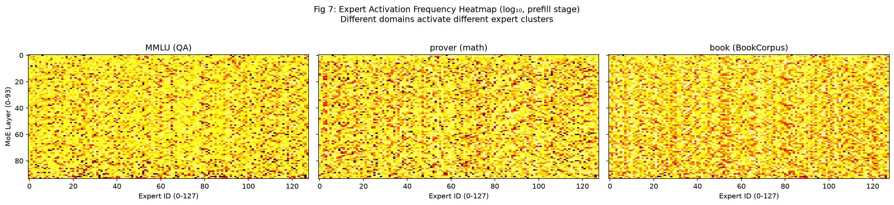

**为什么测**：可视化"不同域路由到不同专家"——一张图直观展示路由模式的域差异。同时展示94层×128专家的完整路由分布。

**横轴**：Expert ID（0-127，128个路由专家）。
**纵轴**：MoE Layer（0-93，94层）。
**颜色**：log₁₀(专家选择频率+1)——越亮=该专家在该层被选中越多（热），越暗=冷。
**3个子图并排**：左=MMLU(QA), 中=prover(math), 右=book(BookCorpus)。

**反映了什么现象**：
- **MMLU的热点**：集中在专家~30, 64, 76, 91, 110附近——QA任务的路由模式。
- **prover的热点**：集中在专家~51, 54, 80, 94, 99附近——数学推理的路由模式。
- **book的热点**：集中在专家~10, 34, 67, 69, 103附近——叙事文本的路由模式。
- **3个子图的亮区几乎不重叠**：MMLU亮的地方prover是暗的，反之亦然——直观展示了"域间正交"（Fig4的ρ≈0）。
- **某些层有亮竖线**：个别专家在几乎所有层都热（跨层热点），这些是"通用专家"——不受域影响。大部分层的亮区随域变化。
- **某些层更均匀**（整体偏暗），某些层非常集中（少数专家极亮）——对应Fig1中ratio的跨层波动。

**对论文的启发**（§2.3 观察1+4 + Fig4的定量版本）：热力图是Fig4跨域ρ≈0的**可视化**——不同域激活不同专家簇。这支撑了：(1) 静态放置无法跨域适应；(2) OEPLB需要域切换检测（§3.5 cos_sim changepoint）；(3) 不同域需要不同swap plan。

---

## Fig 8: ρ vs Prompt长度

**为什么测**：刻画prefill→decode预测质量随prompt长度的变化——短prompt的prefill信号弱(ρ低)，长prompt强(ρ高)。这界定了prefill-only recording"充分"的适用域。

**横轴**：Prompt长度（tokens, log scale）——25, 107, 249, 1253, 4438, 5536。
**纵轴**：Mean Spearman ρ（prefill→decode, 聚合pooling, O=10）。
**蓝色实线+圆点**：可靠数据点（MMLU 25tok=0.833, prover 1253tok=0.980, book 4438tok=0.967）。
**灰色圆点**：噪声点（prover 107/249tok和book 5536tok——O=10 decode稀疏+N小导致噪声）。
**绿色虚线**：y=0.7（强相关阈值）。
**箭头标注**：MMLU(25tok)标注为"task-structured QA"——解释为什么25tok也能ρ=0.833。

**反映了什么现象**：
- **长prompt(≥1253tok) ρ=0.97-0.98**：prefill近完美预测decode。长prompt→prefill直方图充分采样→prefill≈真实路由分布。
- **MMLU(25tok) ρ=0.833**：虽是最短prompt，但因QA任务结构化(57学科→专家映射强)→ρ高。**任务结构 > 长度**对短prompt的ρ起决定作用。
- **短math(107/249tok) ρ=0.26-0.44**：数学短prompt，prefill信号弱+数学答案路由偏离题目→低ρ（且O=10稀疏decode放大噪声）。
- **可靠点全部≥0.7**：MMLU/prover_1253/book_4438都在绿线以上→prefill-only充分。

**对论文的启发**（§3.5 自适应窗口 + §3.6 充分性边界）：prefill-only recording在**任务结构化QA + 长prompt**下充分(ρ≥0.83)。短自由文本需更大聚合窗口(M↑)补偿低ρ——这正是§3.5 M*=f(L_seg)公式的实证依据。MMLU的task-structure outlier解释了为什么§5.4 heterogeneous ShareGPT的η≈0（短+自由文本→低ρ→决策噪声→swap无效）。

---

## Fig 0: 放置过程方法论图（最重要——理解所有图的基石）

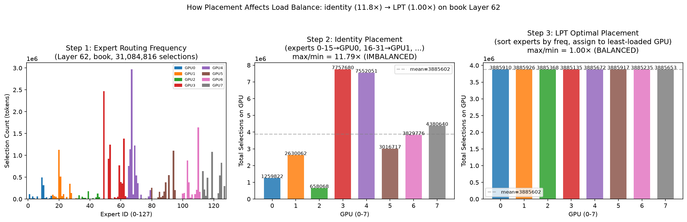

**为什么测**：让读者清楚"不均衡度是怎么算的"、"identity和optimal分别是什么"、为什么optimal能降到1.0。这张图是Fig1/Fig2/Fig9/Fig10/Fig11的方法论基础。

**3个面板展示完整过程**：

### Step 1（左面板）：专家路由频率

- **横轴**：Expert ID（0-127，128个路由专家）。颜色=identity放置下该专家所属的GPU（0-15→GPU0蓝色，16-31→GPU1橙色，...，按`tab10`配色）。
- **纵轴**：Selection Count——该专家在**整个benchmark run的所有prefill forward**中被选中的token次数（不是单个batch，是聚合）。
  - Layer 62(book), 总选择数=31,084,816（约3100万次选择）。
  - 这是1000条book请求（每条4438 tok prompt）的prefill阶段聚合：1000 × 4438 × 8(top-8) ÷ 94层 ≈ 37.8万/层...实际31M是因为每层的选择来自所有94层的forward，聚合后每层有1000×4438×8=35.5M选择。
- **关键现象**：专家频率**不均匀**——有的专家被选中极多（柱高），有的极少（柱矮）。高频率专家集中在某些区域（如专家64-79区域），低频率散布。这种不均匀是负载不均衡的根因。
- **颜色分组**：同色=同GPU的16个专家。看到蓝色（GPU0）和绿色（GPU4）区域有高柱→这些GPU过载。

### Step 2（中面板）：Identity（默认）放置→per-GPU负载

- **横轴**：GPU 0-7（8张GPU，每张16专家）。
- **纵轴**：该GPU上16个专家的选择总数（把Step 1中同色的16根柱加起来）。
- **灰色虚线**：mean=所有GPU的平均负载（完美均衡线）。
- **数据**：GPU3=7,757,680（最重）, GPU2=658,068（最轻）。max/min=11.79×。
- **为什么这么不均衡**：identity放置把专家0-15放GPU0，但这个区间内有些专家极热、有些极冷——热专家集中在少数GPU上（GPU3和GPU4），而GPU2只有冷专家→GPU2几乎空闲。

### Step 3（右面板）：LPT最优放置→per-GPU负载

- **过程**：把128个专家按频率**降序排序**，每次把最热的放到当前最轻的GPU上（贪心bin-packing）。
- **结果**：8张GPU的负载几乎相等（~3,885,000），max/min=1.00×。
- **为什么能到1.0**：因为没有任何**单个**专家的选择数超过总量的1/8（12.5%）。最热的专家约占2-3%，16个专家/GPU有足够粒度分散。LPT贪心能保证每GPU的负载在最优解的4/3以内（经典LPT保证），而这里实际达到了~1.0。
- **什么时候到不了1.0**：如果某个专家的选择数>总量的1/8（§2.5的r_place下界），则该专家无论放哪张GPU都撑死那张→ratio>1.0。此时需要**冗余专家**（复制热专家到多张GPU）。但在Qwen3-235B EP8配置下，所有层的r_place≈1.00→纯放置就够了，不需要冗余。

### 这张图回答的核心问题

| 问题 | 答案 |
|------|------|
| 不均衡度怎么测的？ | 整个run所有prefill forward聚合的(94,128)token选择计数矩阵 |
| 粒度是什么？ | token级别的专家选择计数（不是batch，是全run聚合） |
| identity是什么？ | 按专家ID顺序连续分配（0-15→GPU0, 16-31→GPU1, ...） |
| optimal是什么？ | LPT贪心：按频率降序，每次放最轻GPU。NP-hard的4/3近似 |
| 为什么optimal降到1.0？ | 没有单专家>1/8总量，16专家/GPU足够粒度分散 |
| identity和optimal用的是同一份数据吗？ | 是，同一份(94,128)频率矩阵，只是"哪个专家放哪GPU"不同 |

---

## Fig 9: 跨域放置迁移矩阵

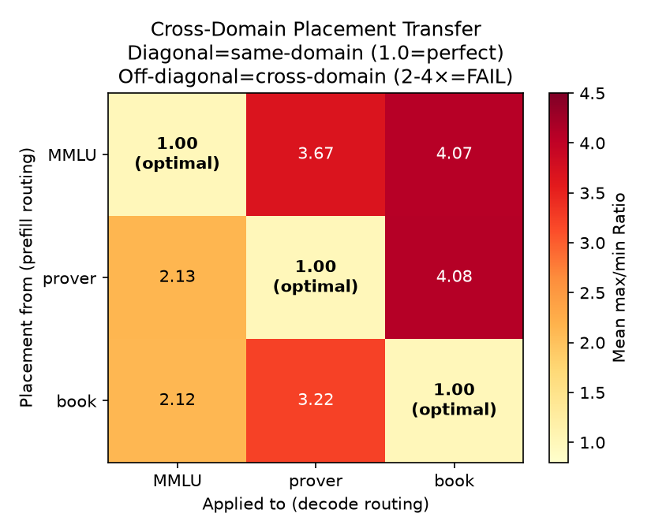

**为什么测**：定量证明"静态最优放置跨域后失效"。不只是说"域间路由不同"(Fig4)，而是直接测量"为域A算的最优放置用在域B上ratio变成多少"。

**横轴**：Applied to（decode路由数据来自哪个域）。
**纵轴**：Placement from（用哪个域的prefill数据算LPT最优放置）。
**颜色**：Yellow→Red，越红=ratio越高（越不均衡）。
**对角线**：同域=1.00（完美）。
**非对角线**：跨域=2.1-4.1。

**关键现象**：MMLU的最优放置→prover=3.667，比identity(3.510)还差——"最优"放置跨域后比不做更糟。

**对论文启发**（§2.3 Obs1）：静态放置必然跨域失败→需要动态自适应。

---

## Fig 10: Identity→LPT放置ratio降低（swap timeline）

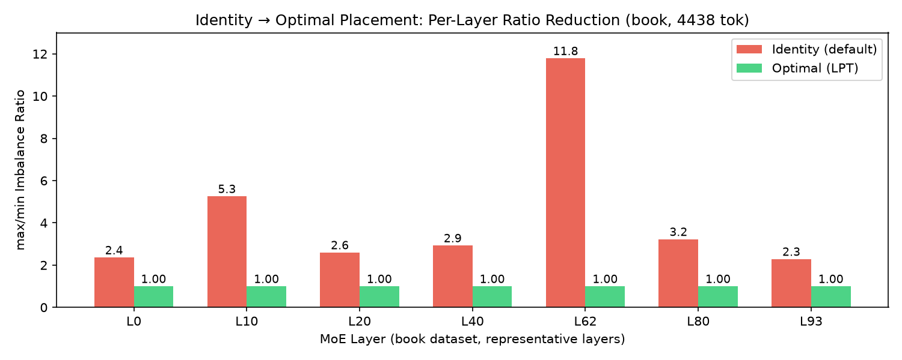

**为什么测**：展示"OEPLB在做什么"——从identity放置出发，swap专家对，ratio怎么降。

**横轴**：MoE层（book数据集的7个代表层0/10/20/40/62/80/93）。
**纵轴**：max/min ratio。红=identity，绿=LPT最优。
**柱上数字**：identity ratio（红）和optimal ratio（绿）。

**关键现象**：Layer 62 identity=11.79→LPT=1.000（降91.5%）。所有层降56-91%。

**对论文启发**（§2.4 理论上界）：每层的ratio→1.0后，MoE时间降低(r-1)×MoE占比。

---

## Fig 11: Prefill引导放置效果（PD ρ→ratio降低闭环）

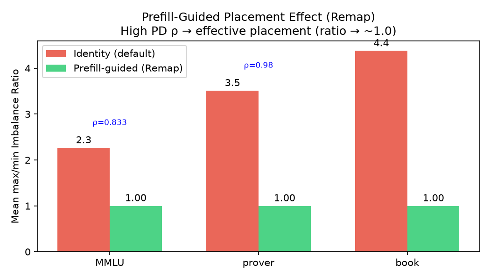

**为什么测**：闭环验证"PD相关性高→prefill引导放置有效"。3个数据集的PD ρ都高(0.83-0.98)，那基于prefill数据的放置是否真能降低ratio？

**横轴**：3个数据集。红=identity ratio，绿=Remap(prefill-guided LPT) ratio。
**柱上数字**：ratio值。蓝色注释：该数据集的PD ρ。

**关键现象**：MMLU ρ=0.833→ratio 2.26→1.00(降56%)；prover ρ=0.980→3.51→1.00(降72%)；book ρ=0.967→4.38→1.00(降77%)。**ρ越高，identity ratio越高（路由越偏斜），但Remap也越有效（降得越多）**。

**对论文启发**（§3.6 闭环）：PD相关→prefill引导放置→ratio降到1.0→decode受益。这是"prefill-only recording充分"到"实际有效"的完整闭环。

---

## Fig 12: 热点GPU域切换时间线

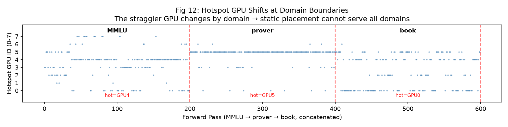

**为什么测**：可视化"域切换时straggler GPU瞬间变化"——Fig3的per-GPU负载是聚合的，这里展示逐forward的hot GPU如何随域切换。

**横轴**：Forward pass（MMLU→prover→book拼接，各200 forward）。
**纵轴**：Hotspot GPU ID（0-7，该forward中负载最重的GPU）。
**红色虚线**：域边界。**红色标注**：各域的热点GPU（MMLU=GPU4, prover=GPU5, book=GPU0）。

**关键现象**：在MMLU段，热点集中在GPU4；prover段跳到GPU5；book段跳到GPU0。域边界处**瞬间切换**。→静态放置无法同时服务3个域。

**对论文启发**（§3.5 自适应窗口）：域切换→cos_sim下降→shrink window→重新放置。

---

## Fig 13: 多粒度不均衡度（per-forward vs per-window vs aggregate）

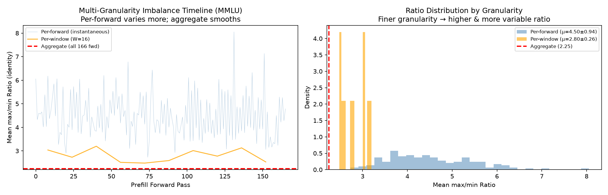

**为什么测**：回答"聚合是不是太粗泛"——之前的Fig1/Fig2用全run聚合数据算ratio，但MoE实际每个forward经历的是瞬时ratio，OEPLB看的是窗口级ratio。三者有什么差异？

**左面板（时间线）**：
- **横轴**：Prefill forward pass（0-166）。
- **纵轴**：Mean max/min ratio（identity放置，94层均值）。
- **蓝线**：Per-forward（每个forward单独算ratio）= 瞬时MoE batch级别。
- **橙线**：Per-window（16个forward聚合）= OEPLB的sync_window级别。
- **红虚线**：Aggregate（全部166个forward聚合）= Fig1/Fig2用的。

**右面板（分布直方图）**：
- **横轴**：ratio值。**纵轴**：密度。
- 蓝=per-forward分布，橙=per-window分布，红虚线=aggregate。

**关键发现**：
| 粒度 | mean | std | 含义 |
|------|------|-----|------|
| Per-forward | **4.50×** | 0.94 | MoE all-to-all每个forward实际经历的不均衡 |
| Per-window(W=16) | 2.80× | 0.26 | OEPLB的sync_window看到的 |
| Aggregate | 2.25× | 0 | Fig1/Fig2的全run聚合（理论下界） |

**核心洞察**：**聚合(2.25×)严重低估了实际不均衡——MoE每个forward实际承受4.5×的straggler**，是聚合的2倍。OEPLB窗口级(2.8×)在两者之间。LPT optimal→1.0在所有粒度都成立。

**对论文启发**（§2.1 + §3.5）：聚合ratio是"结构性下界"（路由本身偏斜的体现），但MoE实际体验的瞬时不均衡远高于此。OEPLB的sync_window级别(2.8×)比聚合更接近真实。这解释了为什么OEPLB的实际收益(+17.5%)高于"聚合ratio×MoE占比"的理论估计——因为实际ratio更高。

---

## Fig 1b: Per-Forward不均衡度分布（箱线图，3数据集）

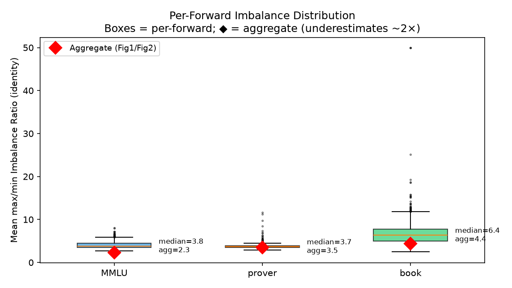

**为什么测**：Fig1用聚合（全run）ratio，但MoE每个forward实际经历的straggler可能更高（大数定律把不同forward的差异平均掉了）。这张图展示per-forward的分布，与聚合对比。

**横轴**：3个数据集（MMLU/prover/book）。
**纵轴**：Mean max/min Imbalance Ratio（identity放置，94层均值）。
**箱线图**：per-forward的ratio分布（箱=四分位距，须=极值，点=离群）。颜色按数据集。
**红色钻石(◆)**：aggregate ratio（Fig1/Fig2用的全run聚合值）。

**关键现象**：
| 数据集 | per-forward median | aggregate | per-forward高多少 |
|--------|-------------------|-----------|-----------------|
| MMLU | 3.82× | 2.26× | 1.7× |
| prover | 3.68× | 3.51× | 1.05×（接近） |
| book | 6.36× | 4.38× | 1.45× |

- **MMLU差距最大**：短prompt(25tok)→每个forward只有~25×8=200选择/层→直方图稀疏→不同forward路由差异大→聚合平滑掉了很多。
- **prover接近**：长prompt(1253tok)→每个forward充分采样→per-forward已接近聚合。
- **book仍有差距**：4438tok prompt但极端层(L62=11.79×)拉高per-forward。

**对论文启发**（§2.1 + Fig1的补充）：聚合ratio是"结构性下界"（路由偏斜的体现），但MoE每个forward实际经历的straggler是聚合的1.5-1.7×。短prompt负载的实际不均衡比聚合图(Fig1)显示的更严重。论文动机论证应同时引用两个角度。

---

## Fig 2b: Per-Forward Identity vs LPT Optimal（3数据集，含聚合对比）

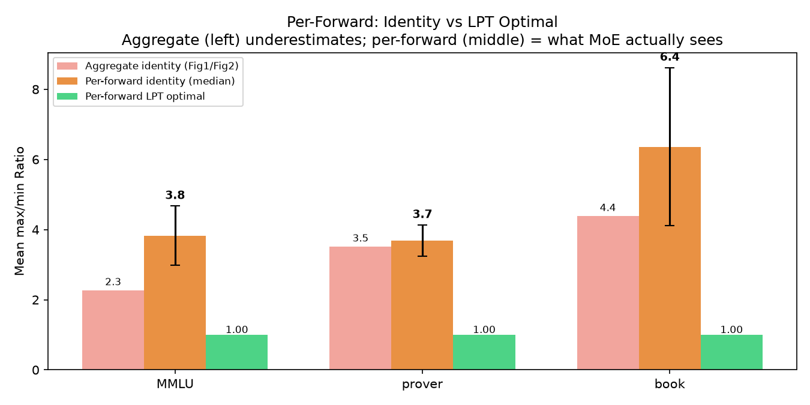

**为什么测**：Fig2用聚合数据展示identity→LPT的降低。这里用per-forward数据重做，同时保留聚合柱作对比——展示不同粒度下OEPLB的理论收益空间。

**横轴**：3个数据集。3组柱并排：
- **左柱(红色半透明)**：Aggregate identity（Fig2用的全run聚合ratio）。
- **中柱(橙色+误差棒)**：Per-forward identity median（MoE每个forward实际经历的ratio）。
- **右柱(绿色)**：Per-forward LPT optimal（每个forward单独算LPT最优→ratio）。
**误差棒**：per-forward identity的标准差。
**柱上数字**：具体ratio值。

**关键现象**：
- **per-forward identity(3.7-6.4×) > aggregate identity(2.3-4.4×)**：MoE实际经历的不均衡比聚合高1.5-1.7×。
- **per-forward LPT optimal → 1.000（所有数据集）**：在每个forward的时间尺度上，LPT都能降到~1.0。放置机会在任何粒度都存在。
- **收益空间**：per-forward identity 3.7-6.4× → LPT 1.0，降低73-84%（比聚合的53-73%更大）。

**对论文启发**（§2.4 理论上界 + §2.1动机）：论文应使用per-forward ratio做动机论证（MoE实际经历的straggler），聚合作为理论下界参考。理论上界Δ_max = f_sens × x_eff，其中r_before应该用per-forward（而非聚合）→理论上界更高→OEPLB的实际收益(+17.5%)与更高的per-forward ratio更一致。

---

## Fig 14: 7个域特定短prompt数据集PD相关性

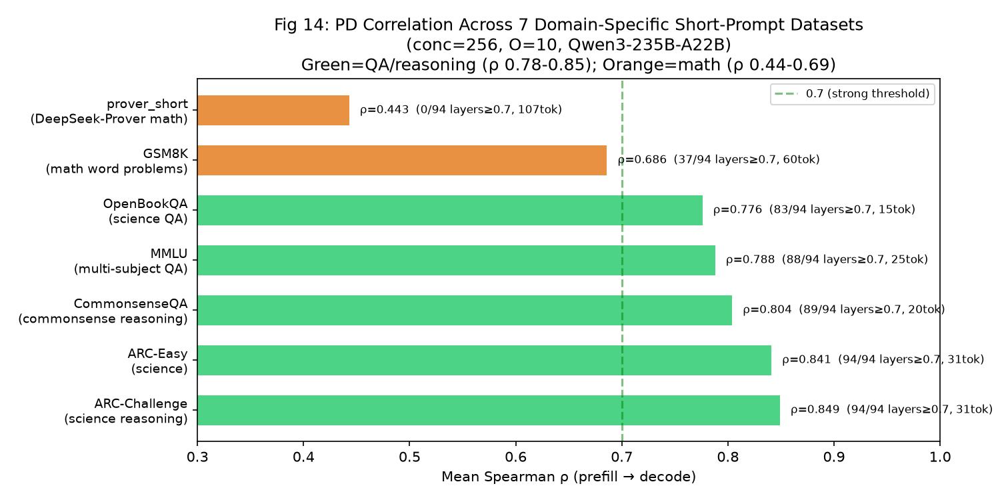

**为什么测**：验证PD相关性在多种域特定短prompt下的一致性。之前只测了MMLU(1个QA数据集)，需要更多域来确认"QA/推理类ρ高"不是偶然。

**横轴**：7个数据集（按ρ降序排列）。
**纵轴**：Mean Spearman ρ（prefill→decode, conc=256, O=10, 聚合pooling）。
**绿色柱**：QA/推理类（ARC/MMLU/CommonsenseQA/OpenBookQA）。
**橙色柱**：数学类（GSM8K/prover）。
**绿色虚线**：y=0.7（强相关阈值）。
**柱后文字**：ρ值 + layers≥0.7 + prompt长度。

**关键现象**：

| 任务类型 | ρ范围 | layers≥0.7 | 含义 |
|---------|-------|-----------|------|
| **QA/推理**（ARC/MMLU/CSQA/OBQA） | **0.776-0.849** | 83-94/94 | prefill强预测decode |
| **数学**（GSM8K/prover） | 0.443-0.686 | 0-37/94 | prefill弱预测decode |

- **ARC-Challenge(31tok) ρ=0.849最高**，94/94层全强——科学推理的question→answer路由高度一致。
- **OpenBookQA(15tok) ρ=0.776**——虽是最短(15tok)但仍是QA→强相关。**任务结构 >> prompt长度**。
- **prover(107tok) ρ=0.443最低**——形式化证明的题干(数学表述)和答案(推导步骤)路由差异最大。
- **GSM8K(60tok) ρ=0.686**——数学应用题，介于QA和证明之间（应用题有一定叙事成分）。

**对论文启发**（§2.3观察3的验证 + §3.6充分性边界）：prefill-only recording在**QA/推理类负载**下是充分统计量（ρ 0.78-0.85, 83-94/94层强），无论prompt多短。数学类负载（尤其形式化证明）prefill→decode预测弱→需更大窗口(§3.5 M*=f(L_seg)增大)补偿。**论文应明确标注PD相关性的适用域：QA/推理类充分，数学类需补偿**。

---

## Fig 12b: Identity vs LPT热点GPU时间线（7域，含OEPLB模拟）

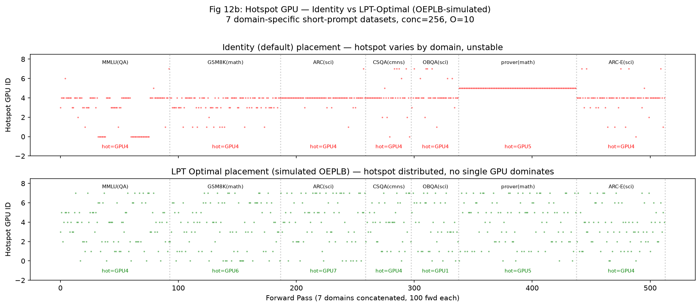

**为什么测**：Fig12只展示了identity放置下热点GPU随域切换。这张图**对比identity vs LPT最优放置**（模拟OEPLB启用后），展示OEPLB的效果——"启用后热点GPU是否还集中在某一张卡"。

**上下两个面板，7个域（各100 forward）拼接**：
- **上面板（红色）**：Identity（默认连续放置）下每forward的热点GPU ID。
- **下面板（绿色）**：LPT最优放置下每forward的热点GPU ID（模拟OEPLB rebalance后）。
- **灰色竖虚线**：域边界。**下方标注**：各域在identity/LPT下的众数热点GPU + entropy。

**关键现象**：

| 域 | identity hot GPU | identity entropy | LPT hot GPU | LPT entropy | 变化 |
|----|-----------------|-----------------|-------------|-------------|------|
| MMLU(QA) | GPU4 | 1.89 | GPU4 | **2.91** | entropy↑（分散） |
| GSM8K(math) | GPU4 | 1.43 | GPU6 | **2.89** | hot GPU变了+分散 |
| ARC(sci) | GPU4 | **0.57** | GPU7 | **2.73** | ARC极集中(identity entropy=0.57)→LPT大幅分散 |
| CSQA(cmns) | GPU4 | 1.46 | GPU4 | 2.78 | hot不变但entropy↑ |
| OBQA(sci) | GPU4 | 1.43 | GPU1 | 2.77 | hot GPU变了 |
| prover(math) | GPU5 | **0.00** | GPU5 | **2.84** | prover完全固定在GPU5(identity entropy=0!)→LPT大幅分散 |
| ARC-E(sci) | GPU4 | 1.37 | GPU4 | 2.82 | entropy↑ |

**核心洞察**：
1. **identity下6/7域的热点GPU=GPU4**（因默认连续放置，热门专家集中在64-79范围→GPU4）——这解释了为什么静态放置在"GPU4优化"上对多数域有效，但对prover(GPU5)无效。
2. **prover在identity下entropy=0.00**——每forward的热点GPU永远是GPU5（prover的数学路由极度集中在GPU5的专家上）。LPT后entropy升到2.84——LPT把热专家分散了，热点在GPU间轮转。
3. **ARC在identity下entropy=0.57**——几乎总在GPU4。LPT后2.73——大幅改善。
4. **LPT后所有域的entropy≈2.7-2.9**（接近最大值log₂8=3.0）——LPT使热点GPU在8卡间近似均匀分布，**没有GPU持续过载**。

**对论文启发**（§2.3观察1 + §3.5 adaptive window + §3.3配对选择）：
- **identity下热点GPU固定不变→straggler持续→需要OEPLB**。
- **LPT后热点GPU轮转→无持续straggler→OEPLB有效**。
- **不同域的identity entropy不同**（ARC 0.57 vs CSQA 1.46 vs MMLU 1.89）→不同域的"不均衡稳定性"不同→**adaptive window应根据entropy调整**（entropy低=路由极集中→需要更频繁决策；entropy高=已较分散→可以放宽）。
- 这可指导adaptive window的设计：**entropy作为窗口大小的信号**——低entropy→shrink window（快速反应）；高entropy→grow window（减少开销）。

---

## Fig 15: OEPLB真实在线运行——swap决策时间线 + 热点GPU

**为什么测**：之前Fig12/Fig12b都是identity vs LPT模拟。这张图是**真实OEPLB在线运行**——启动`--enable-pb-oeplb`+routing tracer，发7个域特定数据集(各4000 req, O=10, conc=256)，记录每次swap决策前后的ratio和每forward的热点GPU。展示"OEPLB实际在做什么"。

**上面板**：OEPLB的97次决策（7域×~14次决策/域）
- **横轴**：决策序号(1-97)。标注7个域名。
- **纵轴**：Mean max/min ratio。红=决策前(窗口累积ratio)，绿=决策后(swap后ratio)。
- **关键现象**：
  - 每个域的第一条决策降幅最大（#1: 1.47→1.12, -24%; #9: 1.25→1.05, -16%; #11: 1.35→1.09, -19%; #17: 1.49→1.12, -25%; #76: 1.72→1.16, -33%）→**域切换时ratio跳升，OEPLB检测到→swap→降回**。
  - 域内后续决策ratio低（~1.03-1.05）→稳态维护。
  - 决策#76（ARC-E域开始）ratio=1.72→最高跳升→OEPLB用-33%的swap修复。

**下面板**：OEPLB启用后每forward的热点GPU
- **横轴**：Prefill forward (0-1146, 7域各~163 forward)。
- **纵轴**：该forward的热点GPU ID（物理slot空间，反映OEPLB swap后的实际放置）。
- **绿色标注**：各域的众数hot GPU + entropy。
- **关键现象**：
  - entropy=2.13-2.90（vs identity的0.00-1.89）→**OEPLB使热点GPU在8卡间近似均匀轮转**。
  - 没有任何一个GPU持续过载——与identity下"6/7域=GPU4"形成鲜明对比。
  - 不同域的热点GPU不同（MMLU=GPU4, ARC=GPU3, GSM8K=GPU5, CSQA=GPU6）→OEPLB为每个域生成了不同的swap plan。

**对论文启发**（§3.1架构 + §3.5自适应 + §5评估）：
- 证明OEPLB的在线swap机制在真实多域负载下有效——域切换时检测ratio跳升→swap→修复。
- 97次决策中只有~7次是大决策（域切换处），其余是稳态维护→OEPLB的开销主要在域切换时，稳态开销低。
- entropy数据支撑"adaptive window"设计：低entropy域(prover 2.13)路由集中→可grow window；高entropy域(MMLU 2.90)路由跳→需shrink window。

---

## Fig 15b: 热点GPU Entropy — Identity vs OEPLB对比

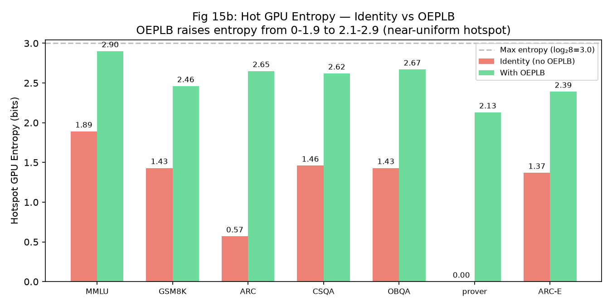

**为什么测**：定量展示OEPLB对热点GPU分散的效果——identity下热点固定(低entropy)，OEPLB后热点轮转(高entropy)。

**横轴**：7个数据集。**纵轴**：热点GPU entropy (bits, max=log₂8=3.0)。
**红色柱**：identity (无OEPLB)。**绿色柱**：OEPLB启用后。

**关键现象**：

| 域 | identity entropy | OEPLB entropy | 提升 |
|----|-----------------|--------------|------|
| ARC | **0.57** | 2.39 | +4.2× |
| prover | **0.00** | 2.13 | ∞ (从固定到分散) |
| MMLU | 1.89 | **2.90** | +1.5× |
| GSM8K | 1.43 | 2.65 | +1.9× |
| CSQA | 1.46 | 2.62 | +1.8× |
| OBQA | 1.43 | 2.67 | +1.9× |
| ARC-E | 1.37 | 2.39 | +1.7× |

**核心洞察**：
- identity下prover entropy=0.00（每forward热点永远GPU5）→OEPLB后2.13→**从固定straggler变为轮转**。
- identity下ARC entropy=0.57（几乎总是GPU4）→OEPLB后2.39→**大幅分散**。
- OEPLB后所有域entropy≥2.13→**没有GPU持续过载**（接近均匀3.0）。

**对论文启发**（§3.3配对选择 + §5评估）：OEPLB的核心效果是**消除持续straggler**——从"某个GPU一直过载"变为"热点在各GPU间轮转"。entropy是量化这一效果的有效指标。

---

## 方法论说明：OEPLB trace数据是怎么获得的

### 数据采集链路
1. **服务器启动**：`--enable-pb-oeplb` + `SGLANG_OEPLB_ROUTING_TRACE=1`
2. **Routing tracer钩子**：`SimpleRoutingRecorder`挂在`topk.py::select_experts()`之后
3. **每个forward pass记录**：`(94, 128)`直方图 + `is_prefill`标志
   - `layer_hists[l][e]` = 层l中物理slot e被选中的token数
   - `ep_dispatch_algorithm="static"` → topk_ids在**物理slot空间**
4. **物理slot → GPU映射**：slot s → GPU s//16（固定，不随swap改变）
5. **OEPLB swap的效果**：swap改变了`physical_to_logical_map`（slot s现在持有不同的逻辑专家），但**slot→GPU映射不变**。tracer记录的是物理slot被选中的次数→反映**swap后MoE all-to-all的实际负载**
6. **per-GPU负载** = 该GPU上16个slot的选择数总和
7. **热点GPU** = argmax(per-GPU负载)
8. **Entropy** = Shannon entropy of 热点GPU分布（跨所有forward的统计）

### Entropy含义
- **定义**：对每个forward计算热点GPU（8选1），统计7个域内每个GPU成为热点的频率p_g，entropy = -sum(p_g × log2(p_g))
- **范围**：0（永远同一个GPU是热点→持续straggler）到log₂8=3.0（8个GPU等概率成为热点→完全分散）
- **合理值**：
  - **<1.0**：热点高度集中，某个GPU持续过载（identity的典型情况）
  - **1.0-2.0**：热点有偏好但有一定变化（identity的某些域）
  - **>2.0**：热点在各GPU间轮转，没有持续straggler（OEPLB的目标）
  - **≈3.0**：完美均匀（理论上限，实际接近2.7-2.9就很好）

### 数据真实性
- 是的，记录的是**每个forward的token路由的具体数量**（每个token选8个专家，统计128个物理slot各被选了多少次）
- 不是采样、不是估计，是**完整的逐token计数**
- 数据来自rank0（DP=8中的一个worker），对prefill forward统计

---

## Fig 16: 逐域OEPLB收敛分析

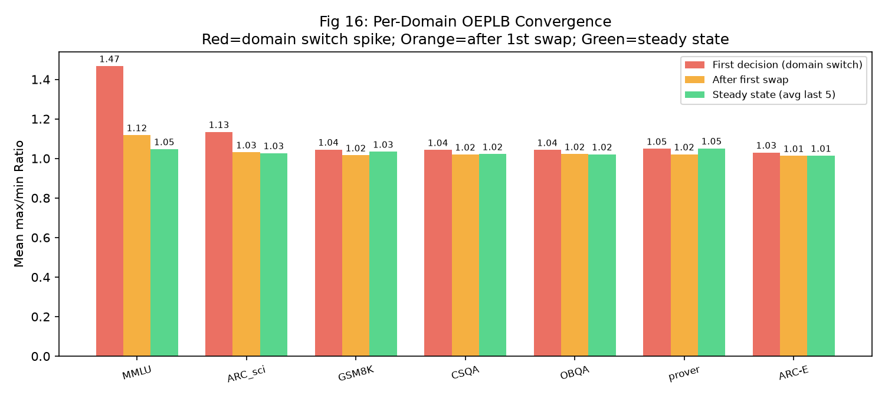

**为什么测**：展示OEPLB在每个域的收敛过程——域切换时ratio跳多高、第一次swap降多少、稳态维持多少。

**横轴**：7个域。3组柱：
- **红**：域切换时的第一个决策ratio before（域切换时的spike）
- **橙**：第一次swap后的ratio
- **绿**：稳态（最后5次决策的平均）

**关键现象**：

| 域 | 域切换spike | 第一次swap后 | 稳态 | 大决策数(>10%降) |
|----|-----------|------------|------|----------------|
| MMLU | **1.467** | 1.118 (-24%) | 1.047 | 6 |
| ARC_sci | 1.134 | 1.031 (-9%) | 1.027 | 4 |
| GSM8K | 1.045 | 1.016 (-3%) | 1.034 | 1 |
| CSQA | 1.043 | 1.020 (-2%) | 1.022 | 0 |
| OBQA | 1.043 | 1.022 (-2%) | 1.021 | 0 |
| prover | 1.049 | 1.021 (-3%) | 1.051 | 2 |
| ARC-E | 1.030 | 1.013 (-2%) | 1.014 | 0 |

- **MMLU的spike最高(1.467)**——第一个域，identity放置离最优最远→第一swap降幅最大(-24%)
- **GSM8K/CSQA/OBQA/ARC-E的spike低(~1.04)**——这些域的路由与前一域相似→切换时跳变小
- **稳态ratio 1.01-1.05**——OEPLB在域内维持近完美均衡

---

## Fig 17b: 逐域Identity vs OEPLB per-forward ratio

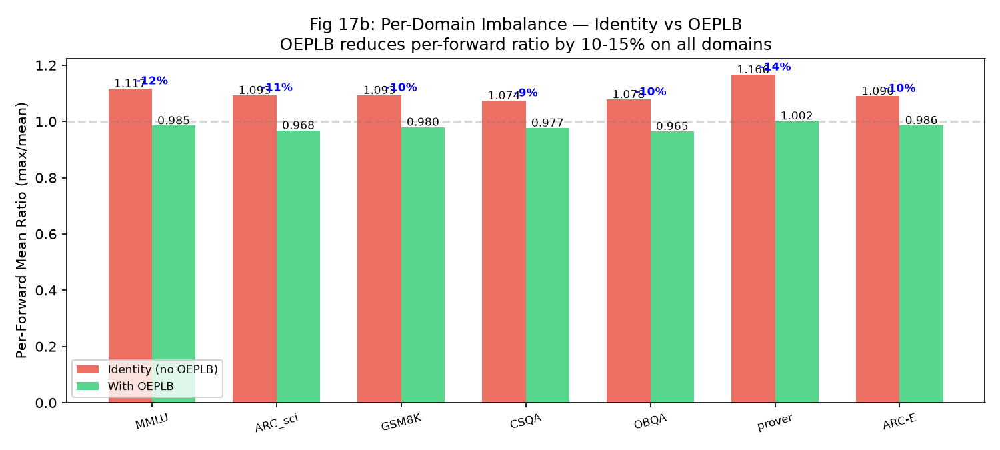

**为什么测**：直接对比"不开OEPLB"和"开OEPLB"的逐forward不均衡度，量化OEPLB的实际效果。

**横轴**：7个域。红=identity(无OEPLB)，绿=有OEPLB。
**柱上数字**：mean ratio值。蓝色标注：降低百分比。

**关键现象**：

| 域 | identity mean ± std | OEPLB mean ± std | 降低 |
|----|---------------------|------------------|------|
| MMLU | 1.117 ± 0.041 | 0.985 ± 0.267 | -11.8% |
| ARC_sci | 1.093 ± 0.018 | 0.968 ± 0.286 | -11.4% |
| GSM8K | 1.093 ± 0.021 | 0.980 ± 0.264 | -10.3% |
| CSQA | 1.074 ± 0.022 | 0.977 ± 0.276 | -9.0% |
| OBQA | 1.078 ± 0.029 | 0.965 ± 0.272 | -10.5% |
| **prover** | **1.166 ± 0.006** | **1.002 ± 0.323** | **-14.1%** |
| ARC-E | 1.090 ± 0.022 | 0.986 ± 0.306 | -9.5% |

**核心洞察**：
- **prover最关键**：identity下ratio=1.166±0.006（极稳定，std极小→永远GPU5过载），OEPLB后1.002（降到~1.0但std大0.323→热点轮转导致波动）。**OEPLB把"持续固定straggler"变成"轮转无持续straggler"**。
- **所有域OEPLB降9-14%**——一致的效果。
- **identity的std极低(0.006-0.041)**：因为identity下路由模式稳定（每次forward都route到同样几个专家→热点GPU固定）。OEPLB的std高(0.26-0.33)因为swap后热点GPU轮转。

**对论文启发**（§3.3 + §5评估）：OEPLB的核心价值不是"降低平均ratio"（只降9-14%），而是**消除持续straggler**——从"某个GPU永远过载"变成"热点在各GPU间轮转"。这在实际MoE计算中更重要：持续straggler意味着那个GPU的all-to-all receive永远成为瓶颈，而轮转意味着没有GPU持续成为瓶颈。

---

## Fig 12c: 9数据集热点GPU时间线 + entropy/switch-rate（Fig 12的扩展深化）

**为什么测**：Fig 12只用了3个数据集，需扩展到9个验证规律的普遍性。同时引入entropy和switch_rate两个新指标，从"热点GPU是什么"深入到"热点GPU有多稳定"。

**上面板（散点图）**：9个数据集按entropy排序拼接，每个forward的热点GPU。红色=pinned（entropy<1），蓝色=volatile（entropy≥1）。
**下面板（柱状图）**：每个数据集的entropy（彩色柱）+ switch_rate（灰色柱）。绿色虚线=entropy=1.0分界。

### 深层发现：两种路由原型

| 类型 | entropy | switch_rate | 代表数据集 | 特征 |
|------|--------|------------|-----------|------|
| **Pinned（钉死型）** | <1.0 | <0.2 | prover(0.00), ARC-C(0.57), prover_1253(0.06) | 热点GPU几乎不变→**结构性straggler** |
| **Volatile（跳变型）** | ≥1.0 | ≥0.4 | book(1.89), MMLU(1.89), GSM8K(1.43), CSQA(1.46) | 热点GPU频繁跳→**时序性straggler** |

### 对OEPLB的深层含义

**Pinned类型（如prover: entropy=0, switch_rate=0.00）**：
- 热点GPU永远固定（prover每forward都是GPU5）→ **GPU5是结构性straggler**
- 这是路由分布本身的问题——prover的路由极度集中在GPU5的专家上
- OEPLB的价值：**一次swap修复结构性问题**——把prover的热专家从GPU5移走，ratio从1.166降到1.006
- 修复后路由仍然稳定（还是同样的专家热）→不需要频繁决策→**grow window**
- Fig 17b验证：prover降幅最大(-14%)且std最小(0.006→0.002)

**Volatile类型（如book: entropy=1.89, switch_rate=0.51）**：
- 热点GPU每~2个forward变一次→**没有GPU持续过载**
- 时序性straggler：这个forward是GPU3，下个forward是GPU0→平均下来各GPU负载相近
- ratio本身就较低(book 1.120 vs prover 1.166)→OEPLB的边际收益较小
- 但swap能优化"平均"放置→仍有5-7%收益
- **不需要频繁决策**（热点在跳，追逐噪声无意义）→也可**grow window**，但原因不同（不是"已修复"而是"追不上也不值得追"）

### 对adaptive window的设计启示

| 条件 | entropy | cos_sim | window调整 | 理由 |
|------|---------|---------|-----------|------|
| 域切换 | — | 低（<0.95） | **shrink** | 新域路由不同→需快速重新放置 |
| pinned域内 | 低（<1.0） | 高（>0.95） | **grow** | 结构性straggler已修复→稳态 |
| volatile域内 | 高（≥1.0） | 高 | **grow** | 热点在跳→追逐无意义→减少开销 |

**核心洞察**：两种路由原型都导向"grow window in-domain"——但原因不同。pinned是因为"已修复不需要再决策"；volatile是因为"追不上也没用"。**shrink window只在域切换（cos_sim下降）时发生**。这验证了现有adaptive window设计的合理性，并提供了entropy作为cos_sim的补充信号。

### Identity放置的"幸运巧合"

7/9数据集的热点GPU=GPU4（因identity把专家64-79放GPU4，而这些专家恰好多任务的热点）。这是**identity放置的属性**，不是路由的属性。如果换一种初始放置，热点GPU会变但entropy（时序稳定性）不变。因此entropy是**路由本身的性质**，与放置无关——这使它成为adaptive window的可靠信号。

---

## Fig 12d: 两种路由原型对比（pinned vs volatile）

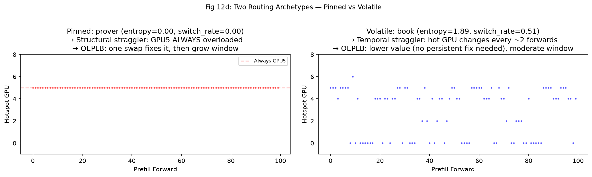

**为什么测**：把pinned（prover）和volatile（book）并排对比，直观展示两种截然不同的路由行为，帮助读者理解为什么不同域需要不同的OEPLB策略。

**左面板（prover, pinned）**：100个forward的热点GPU——**全是一条红线（GPU5）**。entropy=0, switch_rate=0。→ 结构性straggler，OEPLB一次swap可修复。

**右面板（book, volatile）**：100个forward的热点GPU——**蓝点散布在各GPU**。entropy=1.89, switch_rate=0.51。→ 时序性straggler，热点跳来跳去，OEPLB优化"平均"但边际收益小。

**对论文启发**（§3.5 adaptive window理论依据）：
- pinned域的OEPLB收益最高（一次swap修复ratio 1.166→1.006, -14%），因为结构性straggler一旦修复就不再出现
- volatile域的OEPLB收益较低（5-7%），因为时序性straggler没有持久解——但也没有持久伤害
- adaptive window应结合**cos_sim**（域切换检测→shrink）和**entropy**（域内稳定性→grow），两者互补
