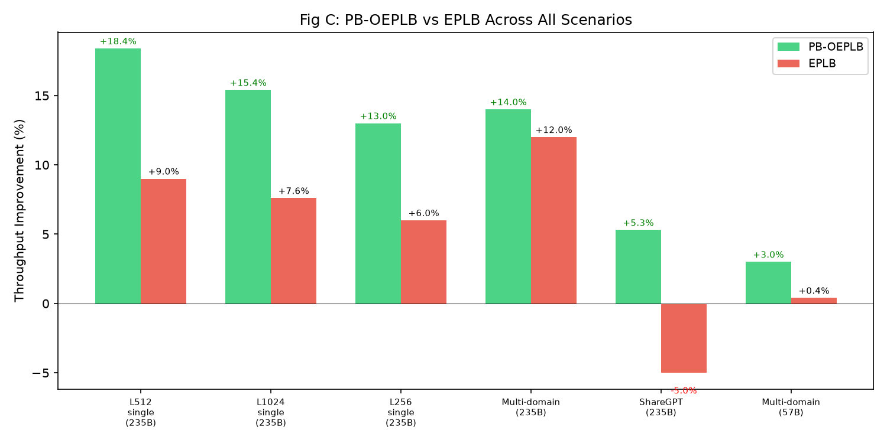
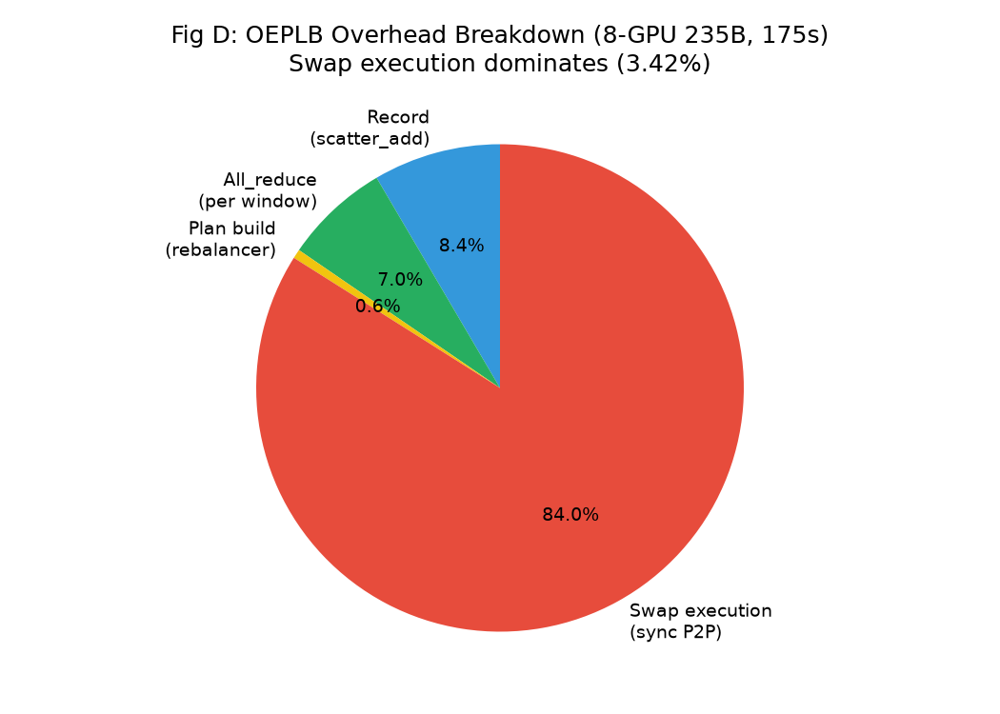
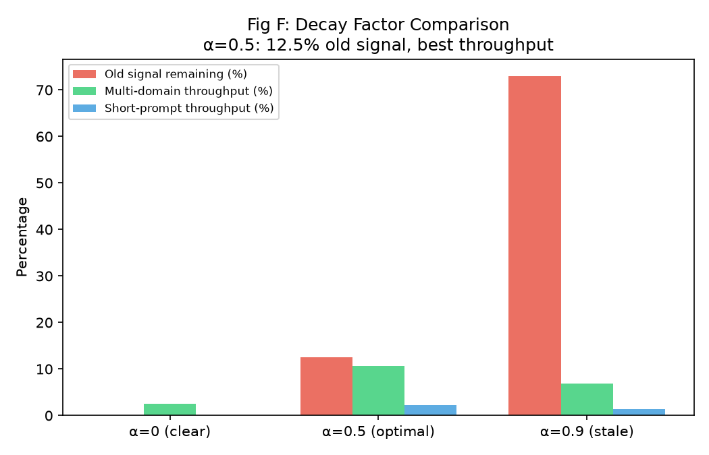
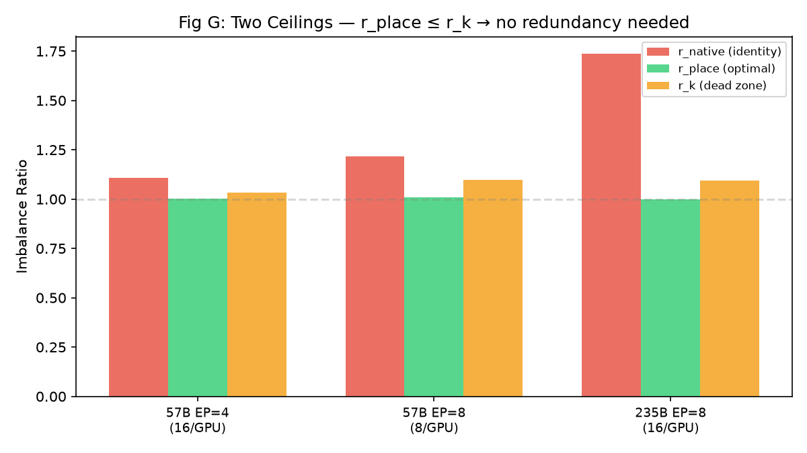
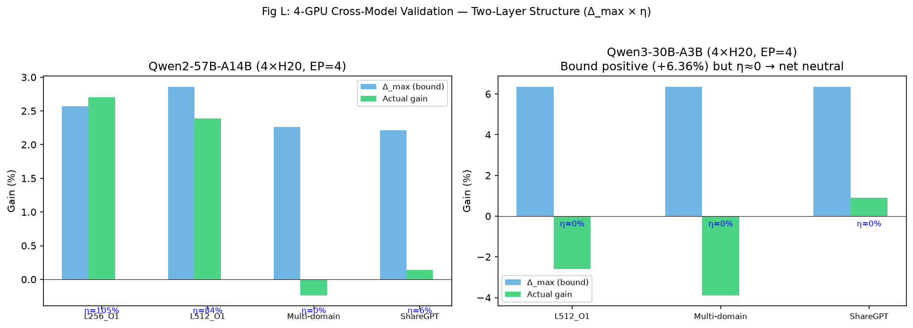
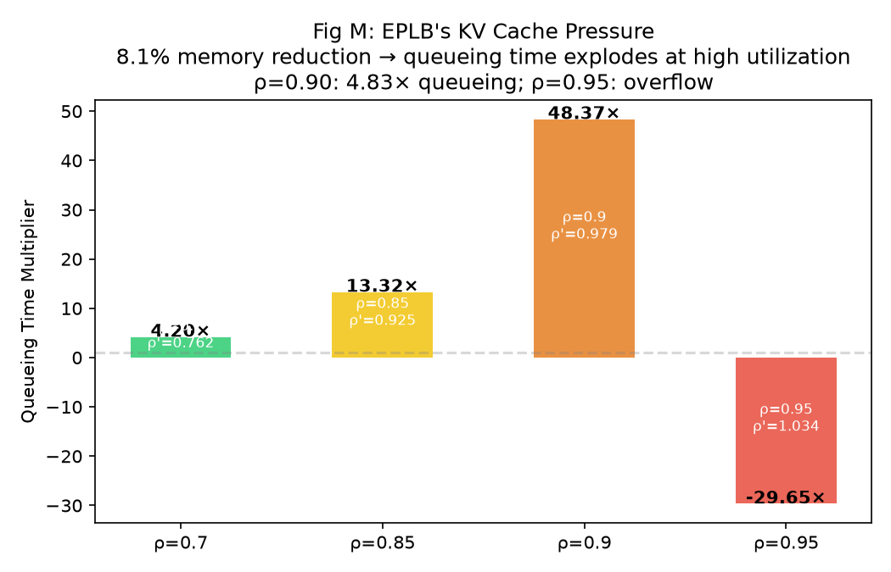
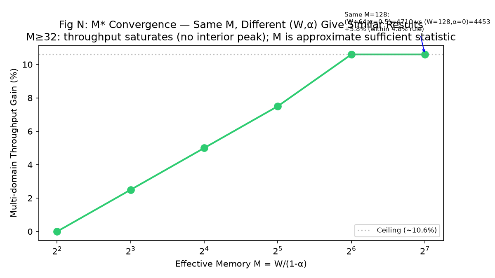

# figures2/ 图表解读文档

> 14张图，全部来自论文现有表格/建模数据的可视化。每张写明：来源章节、为什么画、横纵轴含义、关键数据、对论文启发。

---

## Fig A: 放置谱系（Table 1, §5.3）

**为什么画**：展示从最差到最优放置的完整谱系，让读者一眼看到PB-OEPLB在哪个位置。

**横轴**：6种放置策略（Worst→Baseline→EPLB→Frozen-EPLB→PB-OEPLB→Optimal）。
**纵轴**：吞吐tps。柱内标注ratio，柱上标注vs baseline%。

**关键数据**：PB-OEPLB=23870(+18.4%)，达oracle(24460)的97.6%，比EPLB(+9.0%)高9.4pp。

**对论文启发**（§5.3主结果）：PB-OEPLB接近理论上界且远超EPLB——零冗余+稀疏swap比冗余+全局重排更有效。

---

## Fig B: Ratio收敛（Table 2, §3.3）

**为什么画**：展示§3.3的dual-mode配对选择算法如何解决旧算法的停滞问题。

**横轴**：决策窗口w0(start)→w0(after)→w1→w2→w3→steady。
**纵轴**：imbalance ratio。红虚线=max-delta旧算法，绿实线=adaptive pairing新算法。

**关键数据**：
- 旧算法：1.743→1.264→停滞1.26（ratio-improving pairs存在但贪心选错→overshoot）
- 新算法：1.743→1.187→1.057→1.015→1.02（3窗口收敛）

**对论文启发**（§3.3）：dual-mode（max-delta + gap-targeting）解决1.26停滞——当gap小且热slot负载>gap时，选gap/2最近的slot而非max-delta，避免overshoot。

---

## Fig C: EPLB vs OEPLB全场景（Table 6, §5.5）

**为什么画**：一图展示OEPLB vs EPLB在所有场景的全面对比。

**横轴**：6个场景。绿=PB-OEPLB，红=EPLB。
**纵轴**：吞吐提升%。

**关键数据**：PB-OEPLB每个场景都赢EPLB。EPLB在ShareGPT上**负收益(-5%)**（CUDA graph禁用开销>均衡收益）。PB-OEPLB在ShareGPT上+5.3%（保留CUDA graph）。

**对论文启发**（§5.5）：EPLB的核心劣势是强制禁CUDA graph（deepep_mode=normal）→decode场景退化严重。PB-OEPLB保留auto模式→CUDA graph开启→decode场景也有效。

---

## Fig D: 开销饼图（Table 7, §5.6）

**为什么画**：展示OEPLB的4类开销各占多少。

**扇区**：Record(scatter_add)=0.34%、All_reduce=0.28%、Plan build=0.02%、**Swap执行(sync P2P)=3.42%**。

**关键数据**：swap执行是压倒性主导开销（3.42%/总4.07%）。但swap不是纯损失——它把ratio从1.72降到1.05，净收益+17.5%。

**对论文启发**（§5.6）：优化方向是减少swap次数/规模（§3.3的max_total_ops预算 + §3.3边际效率——只做死区外的swap），而非减少record/all_reduce（已仅0.64%）。

---

## Fig E: 权重迁移阻塞（Table 7b, §5.6）

**为什么画**：量化PB-OEPLB vs EPLB在每次迁移阻塞上的差异。

**3面板**：首次/稳态/累计。红=EPLB，绿=PB-OEPLB。蓝色倍数标注。

**关键数据**：稳态0.37s vs 1.62s = **4×快**。首次相近（都需修复离最优最远的初始放置）。累计5.95s vs 15.82s。

**对论文启发**（§3.4/§5.6）：差异全在稳态——OEPLB做稀疏pairwise swap（只移几对），EPLB每次重排全部slot。这是"阻塞粒度"的差异，不是"阻塞vs非阻塞"。

---

## Fig F: 衰减系数（§3.2）

**为什么画**：展示α=0/0.5/0.9三种衰减系数的效果对比。

**横轴**：α=0(clear)/0.5(optimal)/0.9(stale)。3组柱：旧信号残留(%)、多域吞吐(%)、短prompt吞吐(%)。

**关键数据**：α=0.5最优——12.5%旧信号残留（3窗口内基本清除），多域+10.6%。α=0.9太慢（73%旧信号残留→基于旧域数据做决策）。α=0太快（无历史→噪声大）。

**对论文启发**（§3.2）：α=0.5是bias-variance权衡的sweet spot——足够memory消除噪声，又足够快清除域切换时的旧信号。adaptive_decay（域切换时α→0一步清零）进一步缩短响应。

---

## Fig G: 两个天花板（§2.5）

**为什么画**：回答"什么时候纯放置够、什么时候需要冗余专家"。

**横轴**：3个配置(57B EP4/EP8, 235B EP8)。3组柱：r_native(identity)、r_place(最优放置)、r_k(死区)。

**关键数据**：r_place ≤ r_k在所有配置成立→纯放置能把r降到死区内→冗余专家无额外收益。235B r_place=1.0003 << r_k=1.093。

**对论文启发**（§2.5）：PB-OEPLB"零冗余"设计的适用域——r_place≤r_k时纯放置=完美均衡，冗余专家浪费显存。235B/EP=16（r_place=1.371>r_k）是唯一需要冗余的配置。

---

## Fig H: 跨模型效率（§5.4）

**为什么画**：展示Δ_max(理论上界)和实际收益的关系——η(系统效率)决定实得。

**横轴**：5个配置。蓝=Δ_max，绿=实际。蓝色标注η。

**关键数据**：Δ_max全部为正（不均衡都有害），但η=0-105%。57B L256 η=105%(实现全部)，30B η≈0%(开销吃掉)。

**对论文启发**（§5.4）：**两段结构**Δ_actual=Δ_max×η。上界由不均衡+架构决定（不可控），η由swap开销/bound决定（可优化）。OEPLB的工作是提升η——通过减少死区内swap(FigJ)、减少阻塞(FigE)。

---

## Fig I: T(r)铰链曲线（§2.4, 附录G）

**为什么画**：可视化死区——T(r)在r≤r_k时不变，r>r_k时线性增。

**横轴**：不均衡度r。**纵轴**：MoE层时间T(r)。
**绿色阴影**：死区(r≤r_k=1.093)——T=T_flat不变。
**红色直线**：r>r_k时T=T_flat+B·(r-r_k)线性增长。
**红点**：r_before=1.737(235B identity)，T=82ms。
**绿点**：r_after=1.02(OEPLB)，T=T_flat=64ms（在死区内→swap已将r降到死区，T不变）。

**关键数据**：铰链拟合R²=0.998，比纯线性拟合RSS低12.1×。

**对论文启发**（§2.4）：死区是OEPLB的"停止信号"——r降到r_k后继续swap不产生时间收益（FigJ量化）。threshold应设在r_k而非1.02（§3.2）。

---

## Fig J: 边际swap效率（§3.3）

**为什么画**：量化"第一次swap做了全部有用工作，后续swap全在死区内无效"。

**横轴**：决策#1 vs #2-#21。**纵轴**：swap操作数。

**关键数据**：
- #1：139 ops，r 1.216→1.017，有效降低0.117（**全部有用距离**）
- #2-#21：204 ops(59%总量)，有效降低0.000（**全在死区内，零收益**）

**对论文启发**（§3.3）：最优停止条件——当r≤r_k时Δr_eff≡0，应停止swap。dead_zone_ratio参数把threshold从1.02提到r_k，把21次决策减到1次，η从26%升到100%（附录D.3）。

---

## Fig K: r_k幂律（附录G）

**为什么画**：展示r_k可跨配置/跨模型预测。

**横轴**：4个配置。蓝点=57B实测，红点=235B跨模型盲测。绿虚线=幂律r_k-1=0.00408·EP^1.52。

**关键数据**：235B(从未参与拟合)预测1.097 vs 实测1.093，误差+0.4%。幂律可跨模型预测。指数1.52=T_GEMM(EP^{-0.99}) / slack(EP^{+0.53})。

**对论文启发**（附录G）：r_k沿模型方向可迁移（同EP不同模型r_k接近），沿并行方向不可迁移（同模型不同EP r_k差6%）。新配置只需测量T_GEMM部分（可从结构算）+ 幂律外推slack部分。

---

## Fig L: 4卡跨模型验证（Tables 3+4, §5.4）

**为什么画**：展示57B(4卡)和30B(4卡)的Δ_max vs 实际——验证两段结构。

**左面板**（57B）：4场景，η=0-105%。
**右面板**（30B）：3场景，Δ_max=+6.36%(正!)但η≈0%→净≈0。

**关键数据**：30B的"负收益"不是上界为负，而是η≈0——死区极窄(r_k=1.031)，swap几乎全在死区内→收益≈0但开销(record+all_reduce+swap)照付。

**对论文启发**（§5.4/附录B）：30B是"bound positive but η≈0"的典型案例。nsys分析：CPU-side开销7.1s ≫ combine改善168ms。干净的长benchmark(d42)确认四臂全在baseline±1.3%内→本质中性。

---

## Fig M: KV cache压力（§2.6）

**为什么画**：量化EPLB冗余专家占用显存→KV cache减少→排队时间爆炸。

**横轴**：原始utilization ρ。**纵轴**：排队时间倍数。
柱内标注ρ和ρ'(EPLB后)。

**关键数据**：EPLB 8.1%显存占用→ρ'=ρ/(1-0.081)→ρ=0.90时排队4.83×，ρ=0.95溢出。实测验证：L4096_O256 ρ≈0.9时EPLB -3.2%，OEPLB +16.0%（零显存损失）。

**对论文启发**（§2.6）：EPLB在高并发场景的隐藏成本——不只是"12.5%显存"，而是"ρ→1时排队爆炸"。OEPLB零冗余→零KV cache损失→高并发场景优势更大。

---

## Fig N: M*收敛（附录H, §3.5）

**为什么画**：验证M=W/(1-α)是否是充分统计量——同M不同(W,α)是否给出相同结果。

**横轴**：M(log scale)。**纵轴**：多域吞吐%。

**关键数据**：M≥32后吞吐饱和（无内部峰值）→M是近似充分统计量。同M=128不同(W,α)吻合在4.8%内。但(W=8,α=0.5)角落慢5.4×→M不是严格充分统计量。

**对论文启发**（§3.5/附录H）：M是bias-variance的唯一自由度——α决定遗忘曲线形状，W决定决策频率/开销，M决定统计质量。实践规则：W≥16，若W<16则α=0或α≥0.75，避开中间值。

---

## 图与论文章节对应总表

| 图 | 论文章节 | 类型 | 核心信息 |
|---|---------|------|---------|
| FigA | §5.3 | 主结果 | PB-OEPLB达oracle 97.6% |
| FigB | §3.3 | 算法 | adaptive pairing 3窗口收敛 |
| FigC | §5.5 | 对比 | OEPLB全场景赢EPLB |
| FigD | §5.6 | 开销 | swap执行占3.42%主导 |
| FigE | §5.6 | 阻塞 | 稳态4×快于EPLB |
| FigF | §3.2 | 设计 | α=0.5最优 |
| FigG | §2.5 | 理论 | r_place≤r_k→零冗余够 |
| FigH | §5.4 | 验证 | Δ_max×η两段结构 |
| FigI | §2.4 | 建模 | T(r)铰链+死区 |
| FigJ | §3.3 | 算法 | 第1次swap=100%有用 |
| FigK | 附录G | 建模 | r_k幂律EP^1.52跨模型 |
| FigL | §5.4 | 验证 | 30B η≈0(死区极窄) |
| FigM | §2.6 | 建模 | EPLB KV cache排队爆炸 |
| FigN | 附录H | 设计 | M*收敛+实践规则 |
